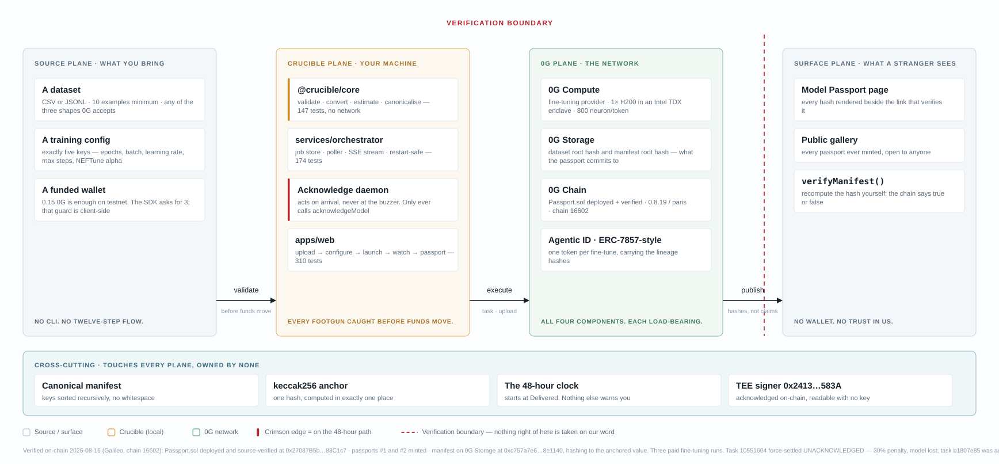
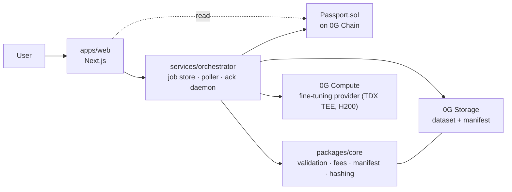

# Crucible

**Verifiable fine-tuning on 0G. Every model gets a birth certificate.**

> Crucible turns fine-tuning on 0G into one upload and issues every model a verifiable birth
> certificate: base model, dataset, hyperparameters and provider, hashed on-chain as an
> ERC-7857 Agentic ID.

0G Bridge Buildathon — Wave 3. Built against the live 0G network; every network fact in this
repo was executed, not read from documentation ([docs/FIELD_NOTES.md](docs/FIELD_NOTES.md)).

---

## Proof of work — live on 0G

| | |
|---|---|
| **`Passport.sol` — 0G Galileo testnet** | **[`0x27087B5bD124f2a570eb22B6B5bbe05F5d83C1c7`](https://chainscan-galileo.0g.ai/address/0x27087B5bD124f2a570eb22B6B5bbe05F5d83C1c7)** |
| Deployment tx | [`0x302a4278…8a6dd1`](https://chainscan-galileo.0g.ai/tx/0x302a4278b9759f985f2e43964a4d5db1c2b6f14ef453935f230441ce728a6dd1) · block 49596815 · gas 2,238,586 |
| **Passport #1 minted** | [`0xb608a8a5…00b3b1`](https://chainscan-galileo.0g.ai/tx/0xb608a8a5eeed36baa04c338ffed54b93458b1486b0cc66739fe36d68e400b3b1) · block 49597171 · gas 327,702 |
| Dataset on 0G Storage | root [`0xa5051ae7…9e7dbfd`](https://storagescan-galileo.0g.ai) · upload tx `0xc38e4131…d7da52` |
| 0G Compute fine-tuning task | `10551604-2664-4516-86cf-269a62f93bfc` on provider `0xA02b95Aa…1E31A09` |
| **`Passport.sol` — 0G mainnet (16661)** | **not yet deployed** — the Wave 3 hard requirement, still open |

Anyone can check the claim without cloning anything:

```
verifyManifest(1, 0x4f64bfe6db470029d79ede7d83b184b003ed88ea380f5f4cce81502c6059890f) → true
verifyManifest(1, keccak256("tampered"))                                            → false
```

> Passport #1 is a **live-chain smoke test, not a completed fine-tune.** Its base-model hash,
> dataset root hash, training config and task ID are the real values from the 2026-08-14 run.
> Its adapter hash is an explicit sentinel, because the adapter was never retrieved — the task
> reached `Delivered` and `acknowledgeModel` failed on Windows. That failure is the exact one
> this project exists to survive, and it happened to us on the first real run.

---

## In plain words

**What it does.** You upload a dataset. Crucible fine-tunes a model for you on 0G and hands
back two things: the working model, and a public certificate proving where that model came from.

**The problem it solves.** Fine-tuning on 0G today is a twelve-step command-line flow with a
trap in it: when your model is ready, a 48-hour timer starts that nobody tells you about. Miss
it and the model is deleted and you are charged 30% anyway. One wrong command locks your
account out of the network permanently. And the proof of how your model was made — which base
model, which data, which settings, which secure chip ran it — is printed to a terminal and lost.

**The value to the ecosystem.** Fine-tuning is the half of 0G Compute almost nobody uses: 21
inference providers against 1 fine-tuning provider, and of the 173 projects ever shipped on 0G,
three touch training and none do provenance. Crucible makes that capability safe to use and
turns its output into something a stranger can verify. Every run is a paid task on 0G, and the
findings along the way — including [three corrections to 0G's own
documentation](docs/FIELD_NOTES.md) — are published for every other builder.



---

## The problem

**You have 48 hours, and nothing tells you.**

When a fine-tuning task on the 0G Compute Network reaches `Delivered`, a 48-hour clock starts.
Acknowledge in time and you get your model. Miss it and you lose the model *and* 30% of the fee
is deducted. There is no notification, no dashboard, no reminder. You are expected to poll a CLI.

**And one wrong call locks you out permanently.**

The 0G compute SDK's own source comments record a May 2026 hackathon bug report: a user
retrieved a model through the legacy two-step download path and never called `acknowledgeModel`.
Days later the artifact was garbage-collected from both 0G Storage and the TEE buffer, at which
point `acknowledgeModel` could no longer succeed — and every subsequent `addDeliverable`
reverted with *"previous deliverable not acknowledged"*. The account's deliverable queue was
**permanently locked**. The escape hatch exists, but it is documented only inside a TSDoc comment.

**Meanwhile, the thing worth keeping is thrown away.**

Every 0G fine-tuning task already emits a complete cryptographic lineage:

| | |
|---|---|
| Pre-trained model hash | which base model, verified on-chain at task creation |
| Dataset root hash | the 0G Storage root hash of the exact training data |
| Training parameters | epochs, learning rate, batch size, max steps, NEFTune alpha |
| TEE delivery | Intel TDX, artifact hash-checked against the on-chain root hash |

Four facts that together answer *"where did this model come from?"* — printed to a terminal and
lost when the buffer scrolls. Nothing surfaces them. Nothing persists them. Nothing makes them
checkable by a third party.

Three more documented footguns sit on the same path — funds silently routed to the wrong
sub-account, duplicate uploads reverting with a bare `CALL_EXCEPTION`, decryption failing with
`second arg must be public key` if you ask one minute too early. All six problems are written
up with evidence in [docs/PRODUCT.md](docs/PRODUCT.md).

---

## The solution

Crucible does two things.

**1. It removes the footguns.** One upload replaces a twelve-step CLI flow. Datasets are
validated and converted locally, before any funds move. Fees are estimated from the live
on-chain price. Funding goes to the correct fine-tuning sub-account. A daemon acknowledges
every delivery well inside the 48-hour window, always through `acknowledgeModel`, never through
the deprecated path — so the locked-queue bug becomes structurally unreachable. For accounts
already stuck, `acknowledgeDeliverable` is exposed as a one-click unlock.

**2. It keeps the lineage.** The four facts above are assembled into a **Model Passport** — a
canonical JSON manifest stored on 0G Storage, its keccak256 hash anchored on 0G Chain, and
minted as an **ERC-7857 Agentic ID** so the model's provenance is a transferable on-chain
object rather than a claim on someone's website.

### What Crucible proves — and what it does not

Crucible proves **lineage, not honest training.**

It proves that this adapter's artifacts hash-match, that this dataset is retrievable at this
root hash, that this provider's TEE signer is acknowledged on-chain, and that 0G's own integrity
check passed on delivery. It does **not** prove the provider actually ran the epochs it claimed.
That needs zero-knowledge proofs over the training computation — PEFT-restricted update circuits
enforcing optimizer semantics, as in [Verifiable Fine-Tuning (arXiv 2510.16830)](https://arxiv.org/html/2510.16830v1).
That is a research programme, not a 16-day build. It is on the roadmap, and it is stated here
because a technical judge will ask.

The "birth certificate" framing is also not ours to claim as novel — vouch-protocol published
the Birth Certificate Protocol in February 2026, OpenSSF ships Model Signing v1.0, and Cisco
open-sourced a Model Provenance Kit in April 2026. What has not been done is bringing this to a
decentralized AI L1 where the training compute, the dataset storage, the attestation anchor and
the model's transferable identity are all native primitives on one stack. Full positioning and
citations: [docs/PRIOR_ART.md](docs/PRIOR_ART.md).

---

## Architecture



Full component, sequence and state diagrams: [submission/ARCHITECTURE.md](submission/ARCHITECTURE.md).

---

## Which 0G components Crucible uses

| 0G component | How Crucible uses it |
|---|---|
| **0G Compute** | Fine-tuning provider discovery, fee calculation, task creation, log streaming, and acknowledgement — via `@0gfoundation/0g-compute-ts-sdk`. Read-only discovery runs with no wallet through `createZGComputeNetworkReadOnlyBroker`. |
| **0G Storage** | The training dataset is uploaded and addressed by root hash; the passport manifest is stored the same way. Both root hashes are what the passport commits to. |
| **0G Chain** | `Passport.sol` is deployed to 0G mainnet (chain 16661). The manifest hash is anchored on-chain and independently verifiable via `verifyManifest`. |
| **0G Agentic ID (ERC-7857)** | Each completed fine-tune mints one Agentic ID token carrying its lineage hashes, with `authorizeUsage` / `revokeAuthorization` for delegated use and authorizations cleared on transfer. |

All four. Details in [submission/ARCHITECTURE.md](submission/ARCHITECTURE.md#which-0g-modules-we-use-and-how).

---

## 0G integration proof

| Item | Testnet — Galileo (16602) | Mainnet — 0G (16661) |
|---|---|---|
| `Passport.sol` | [`0x27087B5b…83C1c7`](https://chainscan-galileo.0g.ai/address/0x27087B5bD124f2a570eb22B6B5bbe05F5d83C1c7) ✅ deployed | `PLACEHOLDER_MAINNET_CONTRACT_ADDRESS` — **open** |
| Source verified on explorer | ⚠️ `hardhat verify` cannot reach the Blockscout endpoint; verifying through the explorer UI | pending |
| Mint transaction | [`0xb608a8a5…00b3b1`](https://chainscan-galileo.0g.ai/tx/0xb608a8a5eeed36baa04c338ffed54b93458b1486b0cc66739fe36d68e400b3b1) ✅ passport #1 | `PLACEHOLDER_MINT_TX_URL` — **open** |
| Fine-tuning task | `10551604-2664-4516-86cf-269a62f93bfc` ✅ reached `Delivered` | — |
| Fine-tuning provider | `0xA02b95Aa6886b1116C4f334eDe00381511E31A09` | `0x940b4a101CaBa9be04b16A7363cafa29C1660B0d` |
| Dataset on 0G Storage | root `0xa5051ae7…9e7dbfd` ✅ uploaded | — |
| TEE signer (acknowledged on-chain) | `0x24135b4Bd964872284728F79F5f17eB874C5583A` | same signer |

Wave 3 requires a **mainnet** contract address plus explorer activity. That row is still open and
is the single largest remaining gap; the testnet deployment above exists to de-risk it, not to
substitute for it. Development runs on testnet to keep real value out of the loop.

Development and the end-to-end fine-tuning spike run on 0G **testnet** (chain 16602, provider
`0xA02b95Aa6886b1116C4f334eDe00381511E31A09`) to keep real value out of the development loop.
The `Passport.sol` deployment and mints are on **mainnet**, which is what the Wave 3 requirement
asks for.

---

## Quickstart

Requires **Node.js ≥ 22**. No GPU and no wallet are needed for the discovery and validation path.

```bash
git clone https://github.com/Professional50coder/crucible.git
cd crucible
npm install        # root workspaces: @crucible/core, @crucible/cli
npm run build
npm test
```

`packages/ml`, `services/orchestrator`, `apps/web` and `contracts` each keep their own
lockfile and `node_modules` so their dependency trees cannot collide. Install and test them
from inside their own directory:

```bash
cd packages/ml          && npm install --no-workspaces && npm test   # 320 tests
cd services/orchestrator && npm install && npm test                  # 155 tests
cd apps/web              && npm install && npm test                  # 158 tests
cd contracts             && npm install && npx hardhat test          #  70 tests
```

### Check the live network — no wallet, no funds

```bash
npm run doctor -w @crucible/cli
```

`crucible doctor` uses 0G's read-only broker, so it needs no private key. It reports the live
fine-tuning providers on both networks, whether each is `occupied`, the hardware quota, the TEE
signer and whether it is acknowledged, the current price per token, an estimated cost for a demo
run, and — if a key is configured — wallet readiness.

### Configure a wallet (only needed to actually train)

```bash
cp .env.example .env
```

| Variable | Meaning |
|---|---|
| `CRUCIBLE_NETWORK` | `testnet` or `mainnet` |
| `PRIVATE_KEY` | funding wallet. Use a throwaway key. `.env` is gitignored — keep it that way. |
| `CRUCIBLE_API_URL` | orchestrator base URL, default `http://localhost:8787` |

Never commit `.env`. Never paste a private key into a terminal you are recording.

### Run the stack locally

```bash
cd services/orchestrator && npm start    # job API + auto-acknowledge daemon, :8787
cd apps/web && npm run dev               # Next.js app, :3000
```

### Deploy the contract

```bash
cd contracts
npx hardhat test
npx hardhat run scripts/deploy.js --network og-testnet   # then og-mainnet
```

Solidity is pinned to **0.8.19** because newer versions fail source verification on the 0G
explorer, and `evmVersion` is **`paris`** because solc 0.8.19 cannot emit `cancun` — that
target arrived in 0.8.24. 0G's docs ask for both; the two are mutually exclusive. Paris
bytecode contains no `PUSH0` and no cancun-only opcodes, so it executes identically on a
cancun-era chain. Probed on this toolchain and written up in `contracts/README.md`.

---

## How to verify a passport yourself

You do not need a wallet, and you do not need to trust us. Given a passport page or token ID:

1. **Fetch the manifest.** The passport page links its manifest by 0G Storage root hash. Download
   it from the 0G indexer, or check the upload on https://storagescan.0g.ai.
2. **Recompute the manifest hash.** Canonicalize the manifest — recursively sort every key, emit
   JSON with no whitespace — then `keccak256` the UTF-8 bytes. This is deterministic by design:
   two manifests with identical content must serialize byte-identically.
3. **Check it against the chain.** Call `verifyManifest(tokenId, yourHash)` on `Passport.sol`.
   It returns `true` only if your recomputed hash equals the one anchored at mint time.
4. **Check the dataset.** The manifest's `dataset.rootHash` is a 0G Storage root hash. Retrieve
   it and confirm the training data is what the passport says it is.
5. **Check the base model.** The manifest's `base.modelHash` is the hash 0G's contract validated
   against registered providers at task creation. Compare it to the provider's registered model.
6. **Check the TEE.** The manifest records the provider's `teeSignerAddress` and whether it is
   acknowledged on-chain. Both are readable from 0G Compute with no credentials.

If step 3 returns `false`, the manifest has been altered since minting. That is the whole point.

---

## Project layout

```
crucible/
├── packages/core/          @crucible/core — dataset validation & conversion, training-config
│                           validation, fee estimation, network config, passport manifest +
│                           canonical hashing, task-state model
├── packages/cli/           @crucible/cli — `crucible doctor`, credential-free network preflight
├── contracts/              Passport.sol (ERC-7857 Agentic ID) + Hardhat tests and deploy scripts
├── services/orchestrator/  job store, 0G task poller, auto-acknowledge daemon, HTTP + SSE API
├── apps/web/               Next.js app: upload → configure → launch → live training →
│                           passport page → public gallery
├── datasets/               demo datasets and their provenance
├── docs/                   PRODUCT · FIELD_NOTES · INTERFACES · PRIOR_ART
├── submission/             Wave 3 package: architecture, demo script, changelog, checklist
└── .paul/                  project brief, roadmap, running state
```

[docs/INTERFACES.md](docs/INTERFACES.md) is the contract between these components — manifest
shape, task states, contract ABI, and the orchestrator's HTTP API.

---

## Status

Honest status as of **2026-08-15**. Nothing below is claimed as working that has not run.

| Area | Status |
|---|---|
| Read-only network probe, both networks | ✅ Working — providers, models, pricing and TEE status verified live |
| `@crucible/core` — config validation, dataset conversion, fee estimation | ✅ Shipped, 105 tests. Fee estimation reproduces 0G's documented worked example |
| `@crucible/core` — passport manifest + canonical hashing | ✅ Shipped, tested |
| `crucible doctor` CLI | ✅ Working against the live network, no wallet needed |
| `packages/ml` — dataset analysis + eval harness | ✅ Shipped, 320 tests |
| Orchestrator + auto-acknowledge daemon | ✅ Shipped, 155 tests, incl. a test asserting the deprecated path is unreachable |
| Web app + passport gallery | ✅ Shipped, 158 tests, clean `next build` |
| `Passport.sol` | ✅ **Deployed to testnet** `0x27087B5b…83C1c7`, 70 tests. ⚠️ Source verification on the explorer still open |
| **End-to-end authenticated fine-tune** | ✅ **Completed on testnet** — task `10551604-…f93bfc` ran `Init → Finished`, fee 0.0118528 0G. No adapter artifact is held locally; see [FIELD_NOTES](docs/FIELD_NOTES.md) |
| First passport minted, `verifyManifest` proven on-chain | ✅ Testnet, passport #1 |
| **Mainnet deployment + mint** | ❌ **Not done** — wallet is unfunded. The one hard Wave 3 requirement outstanding |
| Demo video, X post, AKINDO submission | ❌ Not yet done — team page exists, product not yet registered |

Current position and blockers are tracked in [.paul/STATE.md](.paul/STATE.md); the phase plan is
in [.paul/ROADMAP.md](.paul/ROADMAP.md).

---

## Documentation

| Document | What's in it |
|---|---|
| [docs/PRODUCT.md](docs/PRODUCT.md) | Why this project, the six verified problems, the value argument, what we do not claim |
| [docs/FIELD_NOTES.md](docs/FIELD_NOTES.md) | Live-network facts, the real SDK surface, every footgun, and three corrections to 0G's own docs |
| [docs/INTERFACES.md](docs/INTERFACES.md) | The component contract: manifest, task states, ABI, HTTP API, fixed values |
| [docs/PRIOR_ART.md](docs/PRIOR_ART.md) | What already exists, how Crucible is positioned, and what is reused and under which license |
| [submission/ARCHITECTURE.md](submission/ARCHITECTURE.md) | Diagrams and the module-by-module 0G integration description |

---

## Credits

Built on 0G's `@0gfoundation/0g-compute-ts-sdk` and `@0gfoundation/0g-storage-ts-sdk` (ISC).
Contract and frontend patterns were studied from `0gfoundation/agenticID-examples`,
`0gfoundation/0g-deployment-scripts` and `0gfoundation/fine-tuning-example` and reimplemented
rather than copied; see [docs/PRIOR_ART.md](docs/PRIOR_ART.md) for licenses and attribution.
