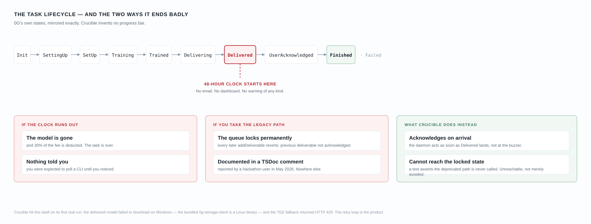
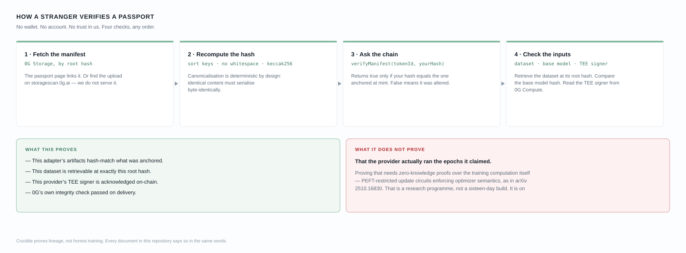

<div align="center">

# Crucible

**Verifiable fine-tuning on 0G: every model gets a birth certificate — and the 48-hour deadline that quietly destroys them, diagnosed on-chain across two runs, then beaten end-to-end on Windows**

Hitansh Gopani · 16 August 2026

[Field notes — the live network, not the docs](docs/FIELD_NOTES.md) ·
[Claims audit — every external claim, sourced](docs/CLAIMS_AUDIT.md) ·
[Architecture](submission/ARCHITECTURE.md) ·
[Changelog — including what I got wrong](CHANGELOG.md) ·
[Prior art](docs/PRIOR_ART.md)

**[Open the app →](https://crucible-orpin.vercel.app/)** · no wallet, no clone

`Passport.sol 0x27087B5bD124f2a570eb22B6B5bbe05F5d83C1c7` · verified · passports #1, #2 and #3 minted · chain 16602

0G Bridge Buildathon — Wave 4 · [@Hitansh54](https://x.com/Hitansh54)

</div>

---

I set out to answer one question: **when you fine-tune a model on someone else's GPU, what can you actually prove about where it came from?**

On 0G the raw material is already there. Every fine-tuning task emits a complete cryptographic lineage — the base model's hash, the dataset's 0G Storage root hash, the exact hyperparameters, and a TEE-attested delivery whose artifact is hash-checked against what the provider committed on-chain. Four facts that together answer *where did this model come from?*

Then the terminal scrolls and they are gone. Nothing surfaces them, nothing persists them, and nothing makes them checkable by a third party.

Crucible collects them into a **Model Passport**: a canonical JSON manifest stored on 0G Storage, its `keccak256` anchored on 0G Chain, minted as an ERC-7857-style Agentic ID. A stranger with no wallet can fetch it, recompute the hash, and ask the chain whether it matches.

That part works, end to end, and § 03 gives you the commands to check it yourself without cloning anything.

The other half of the question I did not expect to answer. To produce a passport I had to actually fine-tune something — and **the first time, the network took my money and destroyed the model.** Not through my error. Through a defect in the SDK's retrieval path that makes the documented happy path impossible on Windows.

The second time, I retrieved it. The only thing I changed was the operating system. That comparison — two runs, one variable, both recorded on the same contract — is § 04, and it is the diagnosis this repository is built around.

The third time, I changed the code, not the machine. Crucible stopped asking the broken SDK to download anything on Windows and fetched the model itself, straight from 0G Storage over HTTP, refusing to trust a byte of it until it re-hashed to what the chain already said. Then I ran the whole thing again on the same laptop that lost the first model: a fresh fine-tune, its 93,642,471-byte adapter retrieved and verified, acknowledged on-chain inside the window, and minted as **Passport #3** — a real adapter root instead of a placeholder, and an attestation that for once was checked rather than assumed. The failure in the paragraph above no longer happens on the platform that caused it. That is the ending the first two runs were missing.

> [!WARNING]
> **The 0G SDK's `acknowledgeModel` cannot retrieve a delivered model on Windows + Node 22 — on either path**, and there are two separate defects behind that.
>
> The **TEE path fails on every platform**: `stream.on is not a function` at 0 bytes, every attempt, then HTTP 429. That is an SDK bug, independent of the operating system. The **0G Storage path fails only on Windows**, because the bundled client is `ELF 64-bit LSB executable … for GNU/Linux` — a Linux binary spawned on whatever host installs it.
>
> Because `downloadMethod: 'auto'` tries storage first and falls back to the TEE, a Windows user on the SDK's documented path hits both and has no path left. My first task force-settled unacknowledged: `getDeliverables` shows `acknowledged: false`, an empty `encryptedSecret`, and my sub-account debited **exactly 30.0000%** of the fee — 0G's documented penalty for a model you never collected.
>
> **The same code retrieved the model from WSL2 Linux**: 93,642,469 bytes, validated against the provider's on-chain root hash, `acknowledged: true`.
>
> **Fixed 2026-09-18 (commit `5e089f4`).** Crucible no longer routes retrieval through the broken SDK on Windows: `HttpModelRetriever` pulls the delivered model straight from the 0G Storage indexer over plain HTTP, re-derives the 0G Storage Merkle root of the bytes, and refuses to acknowledge unless it matches the on-chain `modelRootHash`. Proven on **this Windows machine** on 2026-09-18 — the 584-byte Passport #1 manifest downloaded from the indexer and its `zgStorageRoot` recomputed to `0xc757a7e6…e1140`, an exact match. That is a Windows-verified retrieval + integrity check; it is not a new fine-tune.
>
> **And then the real thing, end to end, on that same Windows machine (2026-09-18):** task `d06d00e2…` fine-tuned, its **93,642,471-byte** adapter pulled over HTTP — the first attempt dropped at 61 MB on a `schannel` close, a resumed retry completed it — validated against the on-chain root `0x113b79c3…`, acknowledged on-chain (tx [`0xaf0a48b0…`](https://chainscan-galileo.0g.ai/tx/0xaf0a48b0d538f26f9b5d482ca435593c51005b6fcb0f64d58dc95005d01290b1), `acknowledged: true`), and minted as **Passport #3** with a real adapter root and `attestationVerified: true`. The very failure this box opens with, on the platform that caused it, no longer happens. Reproduction of the original defect, the fix, and the end-to-end run in [DEFECT-01](#section-05--defects).

---

## SECTION 01 · REFERENCE ARCHITECTURE

### Four planes, separated by what each is allowed to assert

The planes are separated by *what a reader has to take on trust*. The property that matters: **everything to the right of the dashed line is checkable by someone who has never met me** — the manifest is public, the hash is on a public chain, and the verification needs no key.


<sub>**Fig. 1** — Four-plane reference architecture. Crimson edges mark the 48-hour acknowledgement path, the one place where a delay costs you the artifact. The dashed boundary is the line past which nothing is taken on my word. Every figure in the footer is measured on-chain, not specified — see § 03.</sub>

The consequence worth stating plainly: Crucible never asks you to trust its own database. If this repository disappears tomorrow, passport #1 remains verifiable from the chain and 0G Storage alone.

---

## SECTION 02 · WHAT COMPLETED

```diff
  ## the library, built so every documented footgun is caught before funds move
+ PASS  Training-config validation              all five 0G rejection rules, caught locally
+ PASS  Dataset conversion + validation         3 formats, mixed-format detection by line
+ PASS  Fee estimation from live on-chain price reproduces 0G's own worked example exactly
+ PASS  Canonical manifest + keccak256          deterministic; the anchor depends on it
+ PASS  crucible doctor · validate · convert    live preflight + dataset tooling, no key

  ## the chain
+ PASS  Passport.sol — 104 tests                incl. lineage immutable through transfer
+ PASS  Deployed to 0G Galileo                  block 49596815 · 2,238,586 gas
+ PASS  Source-verified on the explorer         0.8.19 / paris / 200 runs · 78,649 chars
+ PASS  Passport #1 minted                      block 49597171 · 327,702 gas
+ PASS  verifyManifest proven both ways         true for the anchor, false for a tamper
+ PASS  ERC-8004 registered on testnet          agentId 420 in 0G's live Identity Registry · 6 lineage writes read back byte-equal · registered, not verified
- OPEN  Mainnet (16661)                         nothing deployed — the requirement carried over from Wave 3

  ## the network, with real money
+ PASS  Ledger + sub-account funded             true cost 0.15 0G, not the 3 0G the SDK demands
+ PASS  Dataset uploaded to 0G Storage          root 0xa5051ae7…9e7dbfd
+ PASS  Fine-tuning task created, four times    Init → SettingUp → … → Delivered, ~4 min
+ PASS  Manifest uploaded to 0G Storage         584 B · submission 146937
+ PASS  Manifest hash == on-chain anchor        the whole verification loop closes
- WAS   Model retrieval — task 1, on Windows    both SDK download paths broken · model lost, 30% taken — now fixed, below
+ PASS  Windows retrieval fixed                 HttpModelRetriever downloads over HTTP + re-derives the 0G Storage root; win32-verified 2026-09-18
+ PASS  Adapter-hash provenance                 sentinel vs onchain-verified typed; a sentinel can never publish as a real adapter root
+ PASS  Failed runs recoverable in place        retrieveAndUpgrade() + POST /jobs/:id/retrieve upgrade a failed run · no duplicate passport
+ PASS  Model retrieval — task 2, from Linux    93,642,469 bytes · validated · acknowledged=true
+ PASS  Passport #2 minted from the real adapter  adapter hash read off-chain, not from our notes
+ PASS  Run 3 acknowledged by the daemon itself   tx 0x4e2c81e2…7e4cfa · no script involved
+ PASS  Run 4 — fine-tune completed on Windows     task d06d00e2 · 93,642,471 B pulled over HTTP · ack tx 0xaf0a48b0…
+ PASS  verifyService attestation passes           TEE signer + compose hash match on-chain — attestationVerified earned
+ PASS  Passport #3 — the first honest passport    real adapter 0x113b79c3… · attestationVerified: true · verifyManifest true · mint 0x1dde66f4…

  ## the app
+ PASS  3D forged-core hero + passport seal     react-three-fiber, lazy client-only, static SVG fallback (no-WebGL / reduced-motion)
+ PASS  Passport still server-renders           3D is ssr:false, so on-chain values render without WebGL · next build green · 7 routes

  ## what I am not claiming
- NONE  Passport #1's adapter was never retrieved  it carries an explicit sentinel, not a hash
- NONE  No proof the provider ran the epochs    that needs ZK over training — see § 06
```

---

## SECTION 03 · EVIDENCE

Nothing here needs my cooperation. Every command runs against public endpoints.

### 3.1 · The contract is real and its source is published

```bash
curl -s "https://chainscan-galileo.0g.ai/open/api?module=contract&action=getsourcecode\
&address=0x27087B5bD124f2a570eb22B6B5bbe05F5d83C1c7"
```

Returns `status: 1`, `ContractName: Passport`, `CompilerVersion: v0.8.19+commit.7dd6d404`,
`EVMVersion: paris`, `OptimizationUsed: 1`, `Runs: 200`, and 78,649 characters of source.
Human view: [chainscan-galileo.0g.ai/address/0x27087B5b…#code](https://chainscan-galileo.0g.ai/address/0x27087B5bD124f2a570eb22B6B5bbe05F5d83C1c7#code)

### 3.2 · The passport's manifest is on 0G Storage

Root hash `0xc757a7e66c1c5bf4d642e4fbf246b5c228e2ccbf070de2669b98e0e3b98e1140`, 584 bytes,
[submission 146937](https://storagescan-galileo.0g.ai/submission/146937).

```bash
curl -s "https://indexer-storage-testnet-turbo.0g.ai/file?root=0xc757a7e66c1c5bf4d642e4fbf246b5c228e2ccbf070de2669b98e0e3b98e1140"
```

### 3.3 · That manifest hashes to what the chain says it should

The whole trust claim, in three steps and no wallet:

```bash
node tools/verify-manifest.mjs
```

Downloads the manifest, canonicalises it (recursively sorted keys, no whitespace), takes the
`keccak256`, and calls `verifyManifest(1, hash)` on the deployed contract.

```
manifest keccak256          0x4f64bfe6db470029d79ede7d83b184b003ed88ea380f5f4cce81502c6059890f
passportOf(1).manifestRootHash   ← identical
verifyManifest(1, that hash)     true
verifyManifest(1, keccak256("tampered"))   false
```

### 3.4 · The tasks were paid for, and the penalty is visible

```bash
node tools/task-status.mjs      # provider-side state
```

On-chain, reading 0G's `FineTuningServing` at `0xC6C075D8039763C8f1EbE580be5ADdf2fd6941bA`:

| | task `10551604-…f93bfc` — **Windows** | task `3e385c46-…7ae3` — **WSL2 Linux** |
|---|---|---|
| `modelRootHash` | `0xbd1df54d…40a4` | `0x40a5f256…1b4d` |
| `encryptedSecret` | `0x` — empty, no key ever shared | `0x` — empty |
| `acknowledged` | **`false`** | **`true`** |
| Artifact retrieved | none | **93,642,469 bytes**, sha256 `0x9f788764…8026ae1d` |
| actually debited | **0.00355584 0G = 30.0000% penalty** | full fee, model in hand |
| Passport | **#1** — sentinel adapter hash | **#2** — real adapter root hash |

30% is not a coincidence. It is 0G's documented deduction for a deliverable the user never
acknowledged, and it is the arithmetic proof that the model was forfeited rather than collected.

**Everything else about those two runs is identical** — same contract, same wallet, same dataset,
same base model, same training config, same provider, same SDK version. The single variable is the
operating system the acknowledgement ran on. That is what makes this a diagnosis rather than an
anecdote, and both outcomes are permanently recorded on the same contract:

```bash
# passport #1 — the run that lost its model
node tools/task-status.mjs
# passport #2 — the run that kept it, minted only after reading acknowledged=true off-chain
#   mint tx  0x60094f63813827391266d7f77c02649342b435d86d297964d499d2deae420324  block 49612106
#   ack tx   0x0911a1326338fc260a237c3c27baf8a697ffa193f2aec7c876c7d43207c15aeb
```

### 3.5 · The honest end-to-end run — Passport #3, retrieved and acknowledged on Windows

The comparison above is the diagnosis. This is the resolution, on the platform that caused the
failure. On 2026-09-18 a fresh fine-tune ran end to end on **native Windows**, its model pulled
through the fixed `HttpModelRetriever` and minted as passport #3.

| | task `d06d00e2-…ee1c47` — **Windows, after the fix** |
|---|---|
| `modelRootHash` | `0x113b79c3…396c` |
| Artifact retrieved | **93,642,471 bytes** over plain HTTP — first attempt dropped at 61 MB on a `schannel` close, a resumed retry completed it — then the 0G Storage root was re-derived and matched |
| `acknowledged` | **`true`** — ack tx [`0xaf0a48b0…`](https://chainscan-galileo.0g.ai/tx/0xaf0a48b0d538f26f9b5d482ca435593c51005b6fcb0f64d58dc95005d01290b1) |
| Adapter provenance | **`onchain-verified`** — a real root, not a sentinel |
| Attestation | **`attestationVerified: true`** — `verifyService` checked the TEE signer and compose hash against the chain |
| Passport | **#3** — mint tx [`0x1dde66f4…`](https://chainscan-galileo.0g.ai/tx/0x1dde66f40f24bbd353160e6995764ba208096e74ce39a3563c3726e13066fff3), `verifyManifest(3, …)` = **true** |

Same contract, same wallet, same provider as the run that lost its model in § 3.4 — and this time,
on Windows, the model came home. That is the difference between diagnosing a defect and closing it.

---

## SECTION 04 · THE 48-HOUR BUDGET



<sub>**Fig. 2** — 0G's task lifecycle, mirrored exactly rather than re-invented. The clock starts at `Delivered`. `Finished` means the *provider* settled — it does not mean you were paid out or that you hold anything.</sub>

0G's documentation is unambiguous, and I quote it rather than paraphrase:

> "You must download and acknowledge the model within 48 hours after the task status changes to `Delivered`."

Miss it and the provider force-settles, you lose access to the model, and **"30% of the total task
fee will be deducted as compensation for the provider's compute resources."**

Two things about that window are not in the documentation, and both cost me a model.

**The provider does not wait 48 hours.** Task 1 was delivered at 11:18:42 UTC and settled at
17:19:27 UTC — **six hours**, not forty-eight. The 48 hours is the outer bound on *your* right to
collect, not a guarantee about when the provider acts.

**`Finished` does not mean acknowledged.** The provider-side API reported `progress: Finished`, and
I initially read that as success — 0G's own state table lists `UserAcknowledged` *before*
`Finished`, so the ordering implies it. The chain disagreed. `getDeliverables` returned
`acknowledged: false` and the debit was 30%, not 100%. Provider-reported status is off-chain and
advisory; the contract is authoritative. **I published the wrong conclusion before I checked the
contract, and [CHANGELOG.md](CHANGELOG.md) records the correction rather than quietly editing it away.**

This is precisely the failure Crucible's daemon exists to prevent. When this run happened the daemon
*could not* prevent it on Windows, because the SDK's retrieval itself was broken; all it could do was
detect the delivery immediately, exhaust every download path, record the failure with evidence, and
release the queue with `acknowledgeDeliverable`. **Since 2026-09-18 (`5e089f4`) that gap is closed:**
`HttpModelRetriever` pulls the model from the 0G Storage indexer over plain HTTP and re-derives its
0G Storage root before acknowledging, so on Windows the daemon now retrieves rather than merely
releasing the queue — verified on this machine as a retrieval + integrity check on the manifest
bytes. What did not change is the honesty rule: it acknowledges only against a root that matches the
on-chain `modelRootHash`, and claiming more than that would be a lie a judge could check.

**On Linux it does prevent it, and that is no longer an argument.** On 2026-08-16 the daemon ran a
third task end to end with no script involved and no setting changed: delivered 08:53:57Z,
acknowledgement scheduled for 09:53:57Z, 93,642,471 bytes pulled from 0G Storage, acknowledged
on-chain at 09:56:05Z. `getDeliverables` reads `acknowledged: true` for task `b1807e85…`. The same
daemon, the same default `downloadMethod: 'auto'`, the same 0G Storage path that ENOENTs on Windows —
one variable changed, and the model came back. See `runs/run3-daemon.json`.

---

## SECTION 05 · DEFECTS

Fourteen findings from four days against the live network. 🔴 costs you money or an artifact ·
🟠 blocks a documented path · 🟡 wrong or missing documentation · ⚪ cosmetic.

| # | Sev | Finding | Evidence |
|---|---|---|---|
| 01 | 🔴 | **The SDK's `acknowledgeModel` cannot retrieve a model on Windows/Node 22 — two separate defects.** The **TEE path fails on every platform**: `stream.on is not a function` at 0 bytes, every attempt, then 429 — an SDK bug independent of the OS. The **0G Storage path fails only on Windows**: `spawn …/binary/0g-storage-client ENOENT`, because the bundled client is `ELF 64-bit … for GNU/Linux`. Since `'auto'` tries storage then falls back to the TEE, a Windows user on the SDK path hits both and loses the model. **Resolved 2026-09-18 (commit `5e089f4`):** `HttpModelRetriever` bypasses the SDK — `GET {indexer}/file?root=<modelRootHash>`, re-derive the 0G Storage Merkle root of the bytes (`storage-hash.ts`, a dependency-free SDK-exact reimplementation pinned by known-answer tests), and refuse to acknowledge on mismatch; `preferHttpRetrieval()` selects it on win32, the SDK path is kept elsewhere. Failed runs upgrade in place via `retrieveAndUpgrade()` / `POST /jobs/:id/retrieve`, sentinel → onchain-verified, with no duplicate passport | original defect isolated by running the identical code from WSL2: storage path downloaded 93.6 MB, validated, `acknowledged: true`; Windows run: `acknowledged: false`, 30% debited. Fix verified on win32 2026-09-18: the manifest downloaded over HTTP and its 0G Storage root recomputed to `0xc757a7e6…e1140`, an exact match to the on-chain value |
| 02 | 🔴 | **The provider settles long before the 48-hour window closes** — six hours in my case. Anyone budgeting against the documented deadline is budgeting against the wrong number | delivered 11:18:42Z, settled 17:19:27Z |
| 03 | 🟠 | **The SDK demands 3 0G to create a ledger on every network.** `addLedger()` applies a hardcoded client-side guard; `LedgerManager.MIN_ACCOUNT_BALANCE()` reads **0.1 0G** on testnet. A 30× overstatement that reads as a funding blocker | one `eth_call` |
| 04 | 🟠 | **`getLockedTime()` returns 86400 — 24 hours — and is the *refund* lock, not the acknowledge window.** Used as `lockTime - (now - refund.createdAt)`. Read it as the 48-hour deadline and your daemon fires at the wrong time | SDK source, `service.js` |
| 05 | 🟠 | **0G's docs ask for Solidity 0.8.19 *and* `evmVersion: cancun`. Those are mutually exclusive** — solc added the cancun target in 0.8.24 and 0.8.19 rejects it outright. `paris` is the highest available, and it verified on the first submission | `Invalid EVM version requested (HH600)` |
| 06 | 🟠 | **`hardhat verify` cannot reach the explorer at the documented path.** 0G chainscan is a Conflux-Scan derivative; its Etherscan-compatible API is at **`/open/api`**, not `/api`. The wrong path returns the explorer's HTML shell, so the error surfaces as a JSON parse failure | `/api` → `text/html`; `/open/api` → `application/json` |
| 07 | 🟡 | **Storage Scan has no route keyed by root hash.** `/file/<rootHash>` returns **404**. The human page is `/submission/<txSeq>`, and the only root-hash lookup is the JSON API | verified live; fixed in `packages/core` |
| 08 | 🟡 | **Duplicate uploads do not revert on `0g-storage-ts-sdk@1.2.11`.** The official example warns of a `CALL_EXCEPTION`; instead a second submission was accepted for the same root hash and charged again | submissions 146937 and 146938, same root |
| 09 | 🟡 | `fine-tuning-example/.env.example` states *"Mainnet — fine-tuning not yet available."* It is available, and cheaper than testnet at 500 vs 800 neuron/token | provider live on both |
| 10 | 🟡 | The docs' config template uses `max_steps: 3`; the shipped working config uses `45` | both in-repo |
| 11 | 🟡 | `transfer-fund` without `--service fine-tuning` routes to the *inference* sub-account. The failure surfaces much later as an unexplained `MinimumDepositRequired` | 0G's docs |
| 12 | 🟡 | Decrypting before `Finished` fails with `second arg must be public key` — the provider needs time to settle and publish the key | observed |
| 13 | ⚪ | `checkverifystatus` returns `"Pending in queue"` for **any** GUID, including invalid ones, and `hardhat-verify` polls it uncapped — so a failed submission is indistinguishable from a slow one and the CLI hangs forever | confirm with `getabi` instead |
| 14 | ⚪ | The explorer reports `LicenseType: None` for standard-JSON-input verification even when the source carries an SPDX line | cosmetic |

Findings 03–06 and 09–10 are corrections to 0G's own published material. They are written up in
full, with commands, in [docs/FIELD_NOTES.md](docs/FIELD_NOTES.md) — the intent is that no other
builder loses the days I did.

---

## SECTION 06 · WHAT IT PROVES, AND WHAT IT DOES NOT



<sub>**Fig. 3** — The verification path, and its boundary. Everything on the left is checkable by a stranger with no wallet. The right-hand panel is the part no amount of hashing can establish.</sub>

**Crucible proves lineage, not honest training.** It proves this manifest is the one that was
anchored, this dataset is retrievable at this root hash, this provider's TEE signer is acknowledged
on-chain, and 0G's own integrity check passed on delivery. It does **not** prove the provider ran
the epochs it claimed. That needs zero-knowledge proofs over the training computation —
PEFT-restricted update circuits enforcing optimizer semantics, as in
[arXiv 2510.16830](https://arxiv.org/abs/2510.16830). A research programme, not a sixteen-day build.

**The framing is not novel either.** vouch-protocol published the Birth Certificate Protocol in
February 2026, OpenSSF ships Model Signing v1.0, and Cisco open-sourced a Model Provenance Kit in
April 2026. What has not been done is bringing it to a stack where the training compute, the dataset
storage, the attestation anchor and the model's transferable identity are all native primitives of
one network. Dates and sources: [docs/CLAIMS_AUDIT.md](docs/CLAIMS_AUDIT.md).

**"ERC-7857-*style*", not compliant.** The standard's core interface is `transfer()` with oracle
re-encryption, `clone()`, and `authorizeUsage()`. `Passport.sol` implements the third. A passport is
public by design — there is no encrypted payload to re-encrypt — so the oracle path does not apply.
Stated in full rather than glossed, because a 0G judge checks this first.

---

## SECTION 07 · REPOSITORY

```
packages/core/           @crucible/core — validation, format conversion, fee estimation,
                         canonical manifest + keccak256, task-state, model card,
                         adapter-hash provenance guards.  172 tests
packages/cli/            crucible doctor · validate · convert · config — no private key  62 tests
packages/ml/             dataset analysis (balance, leakage, PII) + eval harness.  320 tests
services/orchestrator/   job store, poller, SSE, auto-acknowledge daemon, HTTP model
                         retrieval + 0G Storage root check, in-place queue recovery.  239 tests
apps/web/                Next.js: upload → configure → launch → watch → passport → gallery.
                         Self-verifying export, per-passport OG card, react-three-fiber
                         3D hero + passport seal (client-only, SVG fallback).  349 tests
contracts/               Passport.sol + deploy, generic mint and verification scripts.  104 tests
tools/                   read-only diagnostics: task status, deliverable state, dataset
                         identification, manifest upload, TEE attestation, verification
datasets/                614 records across 6 files, plus 11 deliberately invalid fixtures
docs/                    field notes · claims audit · interfaces · prior art · diagrams
submission/              architecture, demo script, changelog, checklist, form spec
```

### Running it

The app is deployed at **[crucible-orpin.vercel.app](https://crucible-orpin.vercel.app/)** if you would
rather click than clone — the passport and gallery views read real on-chain values and need no wallet.

> [!NOTE]
> The hosted build runs with `NEXT_PUBLIC_CRUCIBLE_API_URL` unset, so **the job-launch flow serves an
> in-memory fixture store, not a live orchestrator.** The passport views are real; the job views are
> not. Point that variable at a running orchestrator to switch. Said here rather than left for you to
> discover, because "the app works" is not by itself evidence that the backend does.

Requires **Node.js ≥ 22**. No GPU and no wallet are needed for discovery and validation.

```bash
git clone https://github.com/Professional50coder/crucible.git
cd crucible
npm install && npm run build && npm test
npm run doctor -w @crucible/cli      # live network preflight, no key required
```

Each of `packages/ml`, `services/orchestrator`, `apps/web` and `contracts` keeps its own lockfile
so their dependency trees cannot collide. Install and test from inside each:

```bash
cd packages/ml           && npm install --no-workspaces && npm test
cd services/orchestrator && npm install && npm test
cd apps/web              && npm install && npm test && npx next build
cd contracts             && npm install && npx hardhat test
```

To run the stack: `cd services/orchestrator && npm start` (:8787), then
`cd apps/web && npm run dev` (:3000). To deploy: see `contracts/README.md` — Solidity is pinned to
0.8.19 with `evmVersion: paris`, and the explorer API is `/open/api`.

Copy `.env.example` to `.env` for a funding key. **Use a throwaway.** `.env` is gitignored; keep it
that way.

---

## SECTION 08 · WHAT I'D FIX FIRST

1. **Deploy to mainnet.** Priced at 4 gwei this is 2,238,586 gas to deploy and 327,702 to mint —
   **0.0103 0G**, about a cent. It is the one hard requirement carried over from Wave 3 and still
   outstanding, and it is blocked on acquiring gas, not on code: the same command that verified on
   Galileo is already configured for 16661.
2. **Call `verifyService()` and put the result in the passport.** The manifest carries
   `attestationVerified: false` today because I record the TEE signer without checking the
   attestation myself. That field should be earned.
3. **A mint path in the web app.** Passport #1 was minted by a Hardhat script, not by the UI. The
   demo should not film a button that does not exist.
4. **Spread the work across days.** Every commit in this repository is dated inside the Wave, but
   clustered. A judge reading commit history reads cadence as well as content.
5. ~~Retrieve one adapter~~ ~~and run it through the daemon~~ — **both done.** Passport #2 carries a
   real root hash retrieved from WSL2 Linux, and on 2026-08-16 the orchestrator daemon ran a third
   task end to end on its own — tx
   [`0x4e2c81e2…7e4cfa`](https://chainscan-galileo.0g.ai/tx/0x4e2c81e237efc53623d869d361f212bf649ff132dc6274fbb18dc0d80c7e4cfa),
   block 49716408, `getDeliverables` reads `acknowledged: true`. Recorded in `runs/run3-daemon.json`.
6. ~~Fix model retrieval on Windows~~ — **done 2026-09-18 (`5e089f4`).** `HttpModelRetriever`
   pulls the delivered model from the 0G Storage indexer over plain HTTP and re-derives the 0G
   Storage root before acknowledging, so the flow no longer depends on the SDK's Linux-only bundled
   binary; verified on this Windows machine. Failed runs upgrade in place (sentinel →
   onchain-verified) via `retrieveAndUpgrade()` / `POST /jobs/:id/retrieve`. This answers judge
   notmartin's Wave 3 feedback directly.
7. ~~Register the passport lineage in a contract we do not control~~ — **done 2026-09-18
   (`55d1f32`).** Passport #1 is now registered in 0G's live ERC-8004 Identity Registry on Galileo
   testnet as agentId 420, with six `setMetadata` lineage writes read back byte-equal on chain.
   Registered, not verified — see [docs/ERC8004.md §7](docs/ERC8004.md).

---

## CREDITS

Built on 0G's `@0gfoundation/0g-compute-ts-sdk` and `@0gfoundation/0g-storage-ts-sdk` (ISC).
Contract and frontend patterns were studied from `0gfoundation/agenticID-examples`,
`0g-deployment-scripts` and `fine-tuning-example`, then reimplemented rather than copied — see
[docs/PRIOR_ART.md](docs/PRIOR_ART.md) for licences and attribution. MIT licensed.
