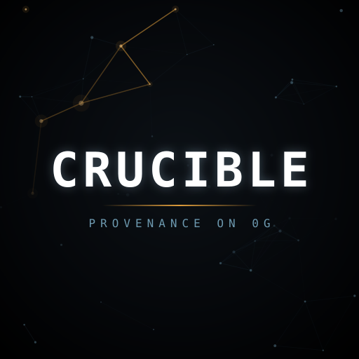
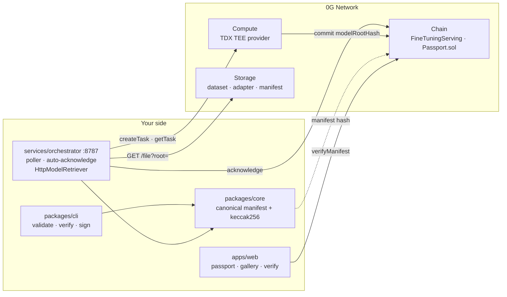

<div align="center">



# Crucible

**Verifiable fine-tuning on 0G. Every model gets a birth certificate.**

A fine-tune on 0G Compute becomes a **Model Passport**: a canonical JSON manifest on 0G Storage, its `keccak256` anchored on 0G Chain and minted as an ERC-7857-*style* Agentic ID. Anyone can check it without a wallet.

[](https://github.com/Professional50coder/crucible/actions/workflows/ci.yml)


[](LICENSE)

[Live app](https://crucible-orpin.vercel.app/) · [Passport #3](https://crucible-orpin.vercel.app/passport/p-000003) · [Contract on explorer](https://chainscan-galileo.0g.ai/address/0x27087B5bD124f2a570eb22B6B5bbe05F5d83C1c7#code) · [Docs](#documentation)

</div>

## 📜 What a birth certificate looks like

This is Passport #3, a real fine-tune run on native Windows (task `d06d00e2-965b-430c-bf46-4d6444ee1c47`, 2026-09-18). The certificate is [`runs/run4/manifest-4.json`](runs/run4/manifest-4.json): 1,027 canonical bytes.

| Field | Value |
|---|---|
| Base model | `Qwen2.5-0.5B-Instruct`, hash `0xb4f76a88…c75a7` |
| Dataset | 61 chat examples, 0G Storage root `0xa5051ae7…dbfd` |
| Training config | 3 epochs, batch 2, lr 0.0002, `max_steps` 10, `neftune_noise_alpha` 5 |
| Adapter | root `0x113b79c3…396c`, 93,642,471 bytes, `hashSource: onchain-verified` (re-derived from the downloaded bytes) |
| Provider / TEE | `0xA02b95Aa…1A09`, signer `0x24135b4B…583A`, `acknowledged: true`, `attestationVerified: true` |
| **Manifest hash** | `0x2e38e49c164712d533c600f6a0242cca9cf75bf3832a28699d9208127685ef13` |
| Anchor | `Passport.sol` token 3, mint tx [`0x1dde66f4…`](https://chainscan-galileo.0g.ai/tx/0x1dde66f40f24bbd353160e6995764ba208096e74ce39a3563c3726e13066fff3) |

Check it yourself. Everything below is real output (full transcripts in [`docs/sample/`](docs/sample)):

```text
$ npm run crucible -- verify runs/run4/manifest-4.json --expect 0x2e38e49c…85ef13
  keccak256  0x2e38e49c164712d533c600f6a0242cca9cf75bf3832a28699d9208127685ef13
  ✓ matches the expected hash

$ ... --expect 0x2e38e49c…85ef14        # one digit changed
  ✗ does not match the expected hash       (exit code 1)

$ node tools/verify-manifest.mjs 0xdfaa9b83…b216a7 3     # live: 0G Storage + Galileo RPC
  keccak256(download)   0x2e38e49c…85ef13   bytes are canonical : PASS
  verifyManifest(real)  true    PASS
  verifyManifest(fake)  false   PASS
  VERIFIED — passport #3
```

The manifest can also be wrapped in a signed DSSE envelope (in-toto Statement, ed25519) and checked offline with a public key and no 0G RPC: [`docs/sample/passport-3.envelope.json`](docs/sample/passport-3.envelope.json). That sample is signed with a throwaway demo key; a signature proves who signed, not that training was honest.

## 🚀 Quickstart

Needs Node.js 22+. No wallet, GPU or network access for steps 1 to 4.

```bash
git clone https://github.com/Professional50coder/crucible.git && cd crucible
npm ci && npm run build
npm run crucible -- verify runs/run4/manifest-4.json --expect 0x2e38e49c164712d533c600f6a0242cca9cf75bf3832a28699d9208127685ef13
npm run crucible -- verify-envelope docs/sample/passport-3.envelope.json --pub docs/sample/demo-signing.pub --expect 0x2e38e49c164712d533c600f6a0242cca9cf75bf3832a28699d9208127685ef13
npm test        # 94 + 180 + 320 tests across cli, core, ml
```

## ✅ Why it exists

On 0G, a fine-tuning task already emits a full lineage: base model hash, dataset root, hyperparameters and a TEE-attested delivery. Then the terminal scrolls and it is gone. Crucible persists it where a stranger can check it, and protects the one workflow step that costs money if you miss it:

- **Lineage a stranger can check.** `verifyManifest(tokenId, hash)` is a `view` call. No key, no trust in this project. If this repository disappeared, Passport #1 would still verify from the chain and 0G Storage alone.
- **The 48-hour acknowledge deadline, handled.** After `Delivered` you must acknowledge within 48 hours or 0G forfeits the model and debits 30% of the fee. That happened to run 1: 0.00355584 0G debited, on-chain. The daemon acknowledges at +1 h (provider settled run 1 after 6 h, not 48).
- **Windows retrieval fixed.** The 0G SDK cannot retrieve a delivered model on Windows. `HttpModelRetriever` fetches it over plain HTTP and refuses to acknowledge unless the re-derived 0G Storage Merkle root equals the on-chain `modelRootHash`. Proven by Passport #3.

## 🏗️ Architecture


```mermaid
flowchart LR
    subgraph you["Your side"]
        CLI["packages/cli<br/>validate · verify · sign"]
        ORCH["services/orchestrator :8787<br/>poller · auto-acknowledge<br/>HttpModelRetriever"]
        CORE["packages/core<br/>canonical manifest + keccak256"]
        WEB["apps/web<br/>passport · gallery · verify"]
    end
    subgraph og["0G Network"]
        COMPUTE["Compute<br/>TDX TEE provider"]
        STORE["Storage<br/>dataset · adapter · manifest"]
        CHAIN["Chain<br/>FineTuningServing · Passport.sol"]
    end
    CLI --> CORE
    ORCH --> CORE
    ORCH -->|createTask · getTask| COMPUTE
    ORCH -->|GET /file?root=| STORE
    ORCH -->|acknowledge| CHAIN
    COMPUTE -->|commit modelRootHash| CHAIN
    CORE -.->|manifest hash| CHAIN
    WEB -->|verifyManifest| CHAIN
```

The services on your side are convenience. Storage and Chain are the trust anchors: anything recorded there is checkable by someone who has never met the author. Full diagrams, contract, API and manifest format: [docs/ARCHITECTURE.md](docs/ARCHITECTURE.md). What it does **not** prove: [docs/THREAT_MODEL.md](docs/THREAT_MODEL.md).

## 🧰 CLI reference

`npm run crucible -- <command>` (or `tsx packages/cli/src/index.ts`). No private key is ever needed.

| Command | Does |
|---|---|
| `doctor [testnet\|mainnet] [--dataset f]` | Live preflight: providers, price, wallet |
| `validate <file.jsonl>` | Check a dataset against 0G's rules; exit 1 if wrong |
| `convert <file> --to chat\|instruction\|text` | Convert between 0G's three dataset formats |
| `config <file.json>` | Validate a training config (all five rejection rules) |
| `verify <manifest> [--expect 0x..]` | Recompute the passport hash; exit 1 on mismatch |
| `card <manifest> [--license id]` | Emit a Hugging Face model card for a passport |
| `keygen <dir>` · `sign` · `verify-envelope` | Offline ed25519/DSSE signing and verification |
| `init <dir>` | Scaffold a starter project |

## 🔌 Orchestrator API

`services/orchestrator`, default `http://127.0.0.1:8787` (no authentication, keep it local).

| Method | Path | Purpose |
|---|---|---|
| `GET` | `/health` | Liveness and version |
| `POST` / `GET` | `/jobs` · `/jobs/:id` | Create / read a fine-tuning job |
| `GET` | `/jobs/:id/logs` · `/jobs/:id/stream` | Provider log · SSE of state changes |
| `POST` | `/jobs/:id/retrieve` | Retrieve, validate and upgrade a failed run in place |
| `POST` | `/jobs/:id/unlock` · `/providers/:provider/unlock` | Release a locked deliverable queue |
| `GET` | `/providers/:provider/lock` | Detect a locked queue (chain error returns 502, never `locked: false`) |
| `GET` | `/passports` · `/passports/:id` | Passport manifests |

Request and response shapes: [docs/INTERFACES.md](docs/INTERFACES.md).

## 📊 Results

Measured on a clean clone, 2026-10-10 (Node 22.14, Windows 11). The README previously said 1,246 tests; the current total is **1,327**.

| Suite | Tests | Reproduce |
|---|---|---|
| `packages/core` | 180 | `npm test` (root) |
| `packages/cli` | 94 | `npm test` (root) |
| `packages/ml` | 320 | `npm test` (root) |
| `services/orchestrator` | 245 | `cd services/orchestrator && npm ci && npm test` |
| `apps/web` | 384 | `cd apps/web && npm ci && npm test` |
| `contracts` | 104 | `cd contracts && npm ci && npx hardhat test` |
| **Total** | **1,327, all passing** | [CI](.github/workflows/ci.yml) runs every suite plus `next build` |

On-chain results, all re-checkable with [`docs/EVIDENCE.md`](docs/EVIDENCE.md):

| Passport | Adapter | Model collected | `attestationVerified` |
|---|---|---|---|
| #1 | explicit sentinel (no adapter) | no: 30% of the fee debited | false |
| #2 | real root (retrieved on WSL2 Linux) | yes | false |
| #3 | real root, `onchain-verified` (native Windows) | yes | true (signer + compose hash) |

Passports #1 and #2 differ in one variable (OS), same code, wallet, dataset and provider. That is a diagnosis, not an anecdote. On 2026-10-10 `tools/verify-manifest.mjs` reported VERIFIED for passports #1 and #3 against the live network.

## 🔭 Observability

The orchestrator exposes `GET /health`, per-job provider logs, an SSE state stream and a recorded `transitions` list on every job, with `ackDeadlineMissed` and `artifactAtRisk` flags. Read-only diagnostics live in `tools/` (`task-status.mjs`, `deliverable-status.mjs`). There is no metrics or tracing endpoint.

## 🔐 Security

- No test needs a private key, funds or a live network. `PRIVATE_KEY` lives in a gitignored `.env`; use a throwaway key.
- Downloaded artifacts are never trusted: the Merkle root is re-derived and compared with the chain before anything is acknowledged or written.
- `Passport.mint` is permissionless by design, so verify manifest contents, not just the hash. The contract has not been independently audited. Read [docs/THREAT_MODEL.md](docs/THREAT_MODEL.md) before relying on it.

## ⚖️ Design decisions

| Why X | Over Y | Number |
|---|---|---|
| Acknowledge at +1 h after `Delivered` | waiting near the 48 h limit | Provider settled run 1 after 6 h; the late path cost 30% of the fee |
| Plain-HTTP retrieval + local Merkle check on Windows | the SDK's `acknowledgeModel` | SDK: 0 bytes both paths. HTTP: 93,642,471 bytes retrieved and root-matched |
| Hash on-chain, manifest on 0G Storage | whole manifest on-chain | 1,027-byte manifest; Passport #3 mint used 293,502 gas |
| Canonical JSON (sorted keys, no whitespace) then `keccak256` | a signature-only scheme | A verifier reimplements it from one file (`tools/verify-manifest.mjs`) |
| ERC-7857-*style*, public lineage | full ERC-7857 oracle re-encryption | Implements `authorizeUsage`; no `transfer()`/`clone()` oracle. Said so |
| Solidity 0.8.19, `paris` | 0G docs' `cancun` | The two are mutually exclusive (solc added cancun in 0.8.24); `paris` verified first try |

More, with trade-offs: [docs/DESIGN_DECISIONS.md](docs/DESIGN_DECISIONS.md). Fourteen defects found against the live network, including six corrections to 0G's own docs: [docs/NETWORK_DEFECTS.md](docs/NETWORK_DEFECTS.md).

## 🗂️ Project tree

```text
packages/core/           canonical manifest + keccak256, dataset/config validation, fee, DSSE, provenance guards
packages/cli/            crucible doctor | validate | convert | config | verify | card | sign | init
packages/ml/             dataset analysis (duplicates, leakage, PII) and eval harness
services/orchestrator/   job store, poller, SSE, auto-acknowledge daemon, HttpModelRetriever, queue recovery
apps/web/                Next.js: passport, gallery, verify, licensing, launch flow (fixture-backed when hosted)
contracts/               Passport.sol, Hardhat tests, deploy/mint scripts, deployments/ records
tools/                   read-only diagnostics, verify-manifest.mjs, run scripts
runs/                    machine-readable records of each live run
datasets/                614 records across 6 files plus 11 deliberately invalid fixtures
docs/                    architecture, threat model, evidence, defects, tutorials, sample certificate
submission/              buildathon-era write-ups and screenshots
```

## 🧱 Stack

| Layer | Technology |
|---|---|
| Language / runtime | TypeScript, Node.js 22+ |
| 0G | `@0gfoundation/0g-compute-ts-sdk` 0.9, `@0gfoundation/0g-storage-ts-sdk` 1.2 |
| Chain | `ethers` 6, `viem`, `wagmi`, RainbowKit |
| Contracts | Solidity 0.8.19 (`paris`), Hardhat 2.22, OpenZeppelin 4.9 |
| Web | Next.js 14, React 18, Tailwind 3, three.js |
| Tests / CI | Vitest, Testing Library, Hardhat/Mocha, GitHub Actions |

## 📚 Documentation

[Architecture](docs/ARCHITECTURE.md) · [Threat model](docs/THREAT_MODEL.md) · [Evidence you can run](docs/EVIDENCE.md) · [Design decisions](docs/DESIGN_DECISIONS.md) · [Network defects](docs/NETWORK_DEFECTS.md) · [Development, testing, deploying](docs/DEVELOPMENT.md) · [Status and roadmap](docs/ROADMAP.md) · [Retrieval and signing tutorial](docs/TUTORIAL_RETRIEVAL_AND_SIGNING.md) · [Field notes](docs/FIELD_NOTES.md) · [Builder kit](docs/BUILDER_KIT.md) · [Claims audit](docs/CLAIMS_AUDIT.md) · [Prior art](docs/PRIOR_ART.md) · [Changelog](CHANGELOG.md)

## Honest limits

- Everything runs on **Galileo testnet (16602). Nothing is deployed on mainnet.** The mainnet deploy is blocked on gas funding, not code.
- The hosted app's job-launch flow serves fixtures; its passport views read the chain.
- Lineage, not honest training: nothing proves the provider ran the epochs it claimed.
- `attestationVerified: true` means two checks (TEE signer, compose hash), not full TDX quote validation.
- ERC-8004 registration (agentId 420) and 0G Agentic ID token #138 are testnet writes to registries this project does not control. "Registered", not "verified".
- The idea is not novel: Birth Certificate Protocol, OpenSSF Model Signing and Cisco's Model Provenance Kit exist ([prior art](docs/PRIOR_ART.md)). Crucible's difference is that the lineage is produced by infrastructure the model owner does not control. No users or customers are claimed.

Built for the 0G Bridge Buildathon. [MIT licensed](LICENSE).
