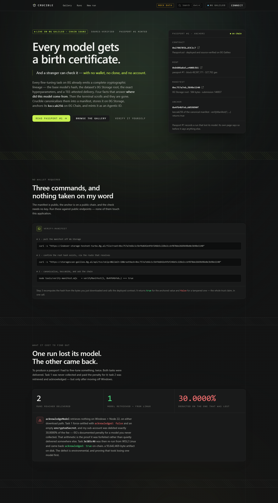
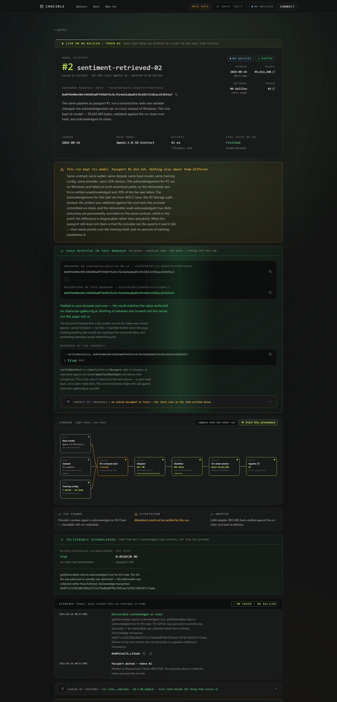
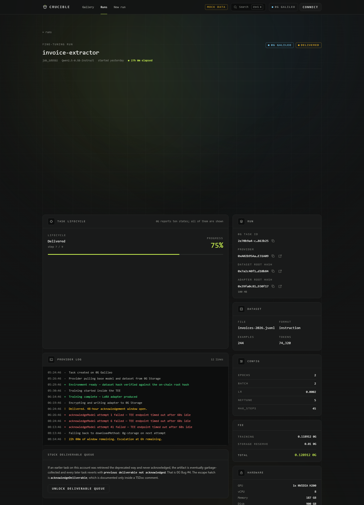
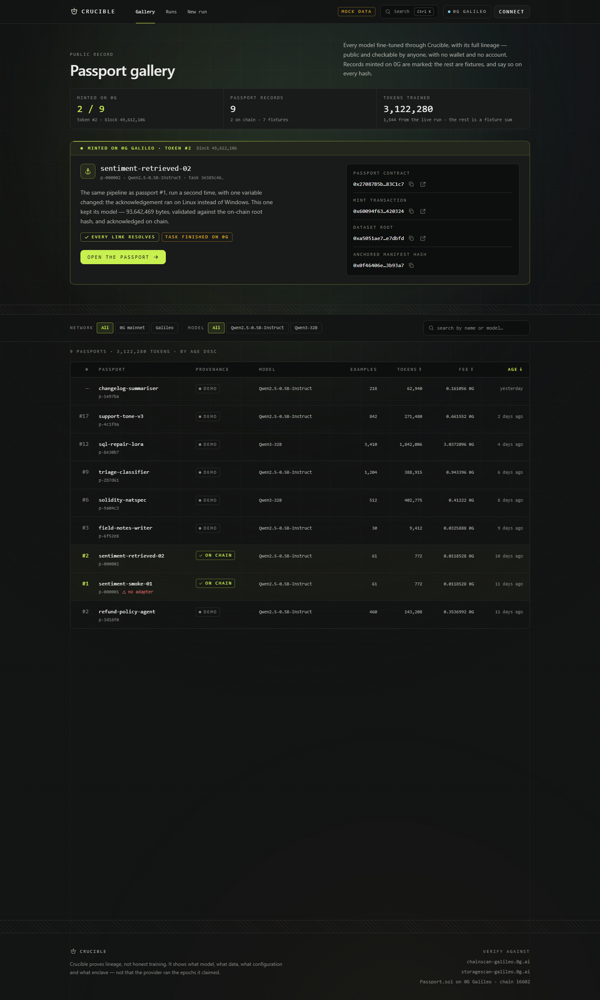
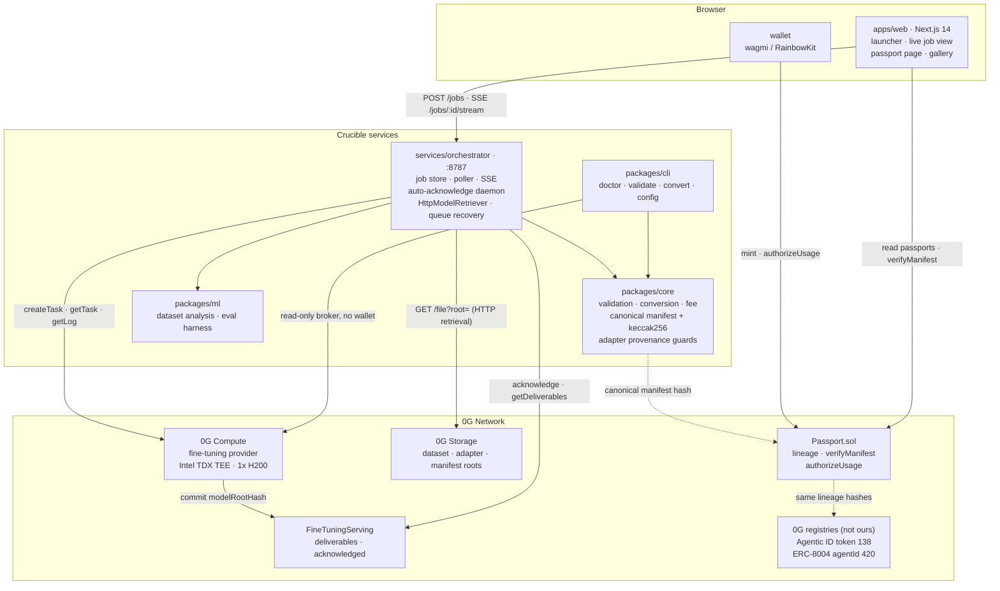

<div align="center">

# Crucible

**Verifiable fine-tuning on 0G. Every model gets a birth certificate.**

A fine-tune on 0G Compute becomes a **Model Passport**: a canonical JSON manifest on 0G Storage, its
`keccak256` anchored on 0G Chain, minted as an ERC-7857-*style* Agentic ID. Anyone can check it
without a wallet.

Hitansh Gopani · first published 16 August 2026 · 0G Bridge Buildathon, Wave 4 · [@Hitansh54](https://x.com/Hitansh54)

`Passport.sol 0x27087B5bD124f2a570eb22B6B5bbe05F5d83C1c7` · source-verified · passports #1, #2 and #3 minted · chain 16602 (Galileo testnet)

</div>

| | |
|---|---|
| **Live app** | [crucible-orpin.vercel.app](https://crucible-orpin.vercel.app/) · no wallet, no clone |
| **Passport #3** (Windows, end to end) | [crucible-orpin.vercel.app/passport/p-000003](https://crucible-orpin.vercel.app/passport/p-000003) |
| **Gallery** | [crucible-orpin.vercel.app/gallery](https://crucible-orpin.vercel.app/gallery) |
| **Contract on explorer** | [chainscan-galileo.0g.ai/address/0x27087B5b…#code](https://chainscan-galileo.0g.ai/address/0x27087B5bD124f2a570eb22B6B5bbe05F5d83C1c7#code) |
| **Manifest #1 on 0G Storage** | [storagescan-galileo.0g.ai/submission/146937](https://storagescan-galileo.0g.ai/submission/146937) |
| **Source** | [github.com/Professional50coder/crucible](https://github.com/Professional50coder/crucible) |
| **Docs** | [Field notes](docs/FIELD_NOTES.md) · [Claims audit](docs/CLAIMS_AUDIT.md) · [Architecture](submission/ARCHITECTURE.md) · [Interfaces](docs/INTERFACES.md) · [Changelog, including what I got wrong](CHANGELOG.md) · [Prior art](docs/PRIOR_ART.md) |

**At a glance**

- **Lineage a stranger can check.** Base model hash, dataset root, hyperparameters, adapter root and TEE signer go into one canonical manifest. `verifyManifest(tokenId, hash)` is a `view` call. No key, no trust in this project.
- **The 48-hour deadline, handled.** An auto-acknowledge daemon collects the model one hour after `Delivered`. Missing the window costs you the model and 30% of the fee. That happened to run 1, on-chain, and is documented as evidence.
- **Windows retrieval fixed.** The 0G SDK cannot retrieve a delivered model on Windows. Crucible's `HttpModelRetriever` pulls it over plain HTTP and re-derives the 0G Storage root before acknowledging. Proven by Passport #3, fine-tuned, retrieved, acknowledged and minted on native Windows.

## Contents

1. [The problem](#1-the-problem)
2. [Why I built it](#2-why-i-built-it)
3. [What it does](#3-what-it-does)
4. [Use cases](#4-use-cases)
5. [Product tour](#5-product-tour)
6. [How it works: Passport #3, end to end](#6-how-it-works-passport-3-end-to-end)
7. [Architecture](#7-architecture)
8. [0G components and protocols used, and why](#8-0g-components-and-protocols-used-and-why)
9. [Design decisions](#9-design-decisions)
10. [Feature matrix](#10-feature-matrix)
11. [Trust, security and limits](#11-trust-security-and-limits)
12. [Evidence you can run](#12-evidence-you-can-run)
13. [Defects found against the live network](#13-defects-found-against-the-live-network)
14. [Where it stands](#14-where-it-stands)
15. [Tech stack](#15-tech-stack)
16. [Repository layout](#16-repository-layout)
17. [Running locally](#17-running-locally)
18. [Testing](#18-testing)
19. [Deploying](#19-deploying)
20. [Roadmap](#20-roadmap)
21. [Credits and licence](#21-credits-and-licence)

---

## 1. The problem

**When you fine-tune a model on someone else's GPU, what can you actually prove about where it came from?**

On 0G the raw material already exists. Every fine-tuning task emits a complete cryptographic lineage:

- the base model's hash,
- the dataset's 0G Storage root hash,
- the exact hyperparameters,
- a TEE-attested delivery whose artifact is hash-checked against what the provider committed on-chain.

Together those four facts answer *where did this model come from?* Then the terminal scrolls and they are gone. Nothing surfaces them, nothing persists them, nothing makes them checkable by a third party.

The workflow around them is also fragile, and the failures cost money:

| Problem | Consequence |
|---|---|
| **48-hour acknowledge deadline** after `Delivered`, with no notification | Miss it and the provider force-settles. You lose the model and 0G deducts **30% of the fee**. |
| **The provider settles early** | Run 1 was delivered at 11:18:42 UTC and settled at 17:19:27 UTC: **six hours**, not 48. |
| **SDK retrieval is broken on Windows + Node 22** | Both download paths fail (see [DEFECT-01](#13-defects-found-against-the-live-network)). A Windows user on the documented path loses the model. |
| **Locked deliverable queue (0G "Bug #4")** | Retrieving via the legacy two-step flow without `acknowledgeModel` can leave every later `addDeliverable` reverting with *"previous deliverable not acknowledged"*. |
| **Docs diverge from the network** | Six corrections to 0G's own published material, recorded in [docs/FIELD_NOTES.md](docs/FIELD_NOTES.md). |

## 2. Why I built it

I set out to answer the provenance question. To produce a passport I had to actually fine-tune something.

**The first time, the network took my money and destroyed the model.** Not through my error. Through a defect in the SDK's retrieval path that makes the documented happy path impossible on Windows. Task 1 force-settled unacknowledged and 30.0000% of the fee was debited.

**The second time, I retrieved it.** The only thing I changed was the operating system: same code, run from WSL2 Linux. Two runs, one variable, both recorded on the same contract. That comparison is the diagnosis this repository is built around.

**The third time, I changed the code, not the machine.** Crucible stopped asking the broken SDK to download anything on Windows and fetched the model itself, straight from 0G Storage over HTTP, refusing to trust a byte until it re-hashed to what the chain already said. A fresh fine-tune on the same laptop that lost the first model was retrieved (93,642,471 bytes), acknowledged on-chain inside the window, and minted as **Passport #3**: a real adapter root instead of a placeholder, and an attestation that was checked rather than assumed.

## 3. What it does

| Capability | Problem removed |
|---|---|
| **Model Passport**: canonical manifest, `keccak256` anchored in `Passport.sol`, minted as an ERC-7857-style Agentic ID | Lineage is thrown away when the terminal scrolls |
| **`verifyManifest(tokenId, hash)`**, a public `view` | Provenance that only the model owner can vouch for |
| **Auto-acknowledge daemon**: acknowledges at +1 h after `Delivered`, fallback at +36 h, latest +40 h, with backoff | The silent 48-hour deadline and its 30% penalty |
| **`HttpModelRetriever`**: `GET {indexer}/file?root=<modelRootHash>`, re-derive the 0G Storage Merkle root, refuse to acknowledge on mismatch | SDK retrieval broken on Windows |
| **Adapter-hash provenance** typed as `sentinel` or `onchain-verified`, with guards | A placeholder being published as a real adapter root |
| **In-place recovery**: `retrieveAndUpgrade()` and `POST /jobs/:id/retrieve` | A failed run needing a duplicate passport |
| **Queue unlock**: `POST /jobs/:id/unlock`, `GET /providers/:provider/lock`, `POST /providers/:provider/unlock` (wrapping `acknowledgeDeliverable`) | The Bug #4 locked deliverable queue |
| **Local preflight in `@crucible/core`**: all five 0G training-config rejection rules, dataset validation and conversion across 3 formats, fee estimation from live on-chain price | Funds spent on a task 0G will reject |
| **Dataset quality analysis** (`packages/ml`): duplicates, train/test leakage, PII and secrets with Luhn-checked card numbers. Advisory, never blocks a job | Training on leaked or sensitive data unknowingly |
| **`crucible doctor · validate · convert · config`** | Discovery and validation that need a funded key |
| **[Field notes](docs/FIELD_NOTES.md)** with commands | Hours lost to doc-versus-network contradictions |

## 4. Use cases

- **Prove a fine-tune's origin to a third party.** Share a passport link. The reader recomputes the manifest hash and asks the chain. Nothing depends on this repository staying online.
- **Fine-tune on 0G without losing the model.** The daemon acknowledges on arrival, not at the deadline.
- **Fine-tune on 0G from Windows.** HTTP retrieval replaces the SDK's Linux-only bundled binary.
- **Recover a stuck account or a failed run.** Unlock a stranded deliverable queue; upgrade a failed run from sentinel to verified once the artifact is retrieved.
- **Check a dataset before paying for training.** Validate format, catch the five config rejections, estimate the fee, scan for leakage and PII.
- **Delegate model use.** `authorizeUsage` / `revokeAuthorization` on a passport, capped at 100 per token and cleared on transfer. This is the primitive a licensing flow would build on (planned, see [Roadmap](#20-roadmap)).

## 5. Product tour

The hosted app reads real on-chain values for passports. The job-launch flow is fixture-backed (see the note in [Running locally](#17-running-locally)).

| Route | What it shows |
|---|---|
| `/` | 3D "forged core" hero, the live on-chain anchor panel, the verification commands, and the run-1 versus run-2 evidence |
| `/gallery` | Every passport, with on-chain passports and fixtures labelled as such |
| `/new` | Dataset drop, network and base model, all five training parameters with 0G's defaults, live fee estimate, provider card (H200, Intel TDX / Phala dstack) |
| `/jobs`, `/jobs/[id]` | Run list; a single run's ten-state machine, provider log and 48-hour acknowledge countdown |
| `/passport/[id]` | The passport: full manifest, every hash linked to its proof, an in-browser hash check against the chain, a 3D seal, a self-verifying export and a per-passport Open Graph card |

Passport ids take the form `p-000001`, `p-000002`, `p-000003`.

| Home | Passport #2, live |
|---|---|
|  |  |
| **Job detail with acknowledge countdown** | **Gallery** |
|  |  |

Screenshots were captured from the live app on 2026-08-26, before Passport #3 existed. Full set: [submission/screenshots/INDEX.md](submission/screenshots/INDEX.md).

## 6. How it works: Passport #3, end to end

The real run, 2026-09-18, on native Windows. Task `d06d00e2-965b-430c-bf46-4d6444ee1c47`.

```mermaid
sequenceDiagram
    autonumber
    participant D as Dataset (0G Storage)
    participant P as 0G Compute TEE provider
    participant R as HttpModelRetriever
    participant F as FineTuningServing (0G Chain)
    participant S as 0G Storage
    participant X as Passport.sol

    Note over D: sentiment set, 61 chat examples,<br/>root 0xa5051ae7…9e7dbfd (reused, no re-upload)
    P->>P: Init → SettingUp → … → Delivered
    P->>F: commit modelRootHash 0x113b79c3…396c
    R->>S: GET {indexer}/file?root=0x113b79c3…
    Note over R: first attempt dropped at 61,351,230 B<br/>(schannel close); resumed retry<br/>completed 93,642,471 B
    R->>R: re-derive 0G Storage Merkle root
    R-->>R: matches on-chain root → hashSource: onchain-verified
    R->>F: acknowledge (tx 0xaf0a48b0…, block 55,456,191)
    F-->>R: acknowledged: true
    Note over R: verifyService: TEE signer + compose hash<br/>match on-chain → attestationVerified: true
    R->>S: upload canonical manifest (root 0xdfaa9b83…b216a7)
    R->>X: mint token 3 with manifest hash 0x2e38e49c…85ef13<br/>(tx 0x1dde66f4…, block 55,457,526)
    X-->>R: verifyManifest(3, 0x2e38e49c…) = true
```

Step by step:

1. **Fine-tune.** The task ran `Init → … → Delivered → UserAcknowledged` against the testnet provider `0xA02b95Aa6886b1116C4f334eDe00381511E31A09` on base model `Qwen2.5-0.5B-Instruct`, with `num_train_epochs: 3`, `per_device_train_batch_size: 2`, `learning_rate: 0.0002`, `neftune_noise_alpha: 5`, `max_steps: 10`.
2. **Retrieve.** `HttpModelRetriever` downloaded the 93,642,471-byte adapter from the 0G Storage indexer. The first attempt died at 61 MB; a resumed retry (a curl `fetchImpl` passed into the retriever, transport only) completed it.
3. **Validate before acknowledging.** The retriever re-derived the 0G Storage Merkle root and matched it to the on-chain model root `0x113b79c3b6c6a0bfa418e044770171b02b475e185fbbdf0ddc932ec6348a396c`.
4. **Acknowledge.** Tx [`0xaf0a48b0…`](https://chainscan-galileo.0g.ai/tx/0xaf0a48b0d538f26f9b5d482ca435593c51005b6fcb0f64d58dc95005d01290b1), `acknowledged: true`.
5. **Attest.** `verifyService` passed: the TEE signer `0x24135b4Bd964872284728F79F5f17eB874C5583A` matches the on-chain registration and the compose hash matches the event log. Recorded in `runs/attestation-testnet.json`.
6. **Build the manifest.** `@crucible/core` canonicalises it (keys sorted recursively, no whitespace) and takes `keccak256`: `0x2e38e49c164712d533c600f6a0242cca9cf75bf3832a28699d9208127685ef13`.
7. **Store it.** 1,027 bytes on 0G Storage at root `0xdfaa9b837e339c2aa87c8e52fed102390ffeb22392beb58d4ffb3589aab216a7`, upload tx `0x990ea1f4…3cc015`.
8. **Mint.** Token 3, tx [`0x1dde66f4…`](https://chainscan-galileo.0g.ai/tx/0x1dde66f40f24bbd353160e6995764ba208096e74ce39a3563c3726e13066fff3). `verifyManifest(3, …)` returns `true`; a wrong hash returns `false`.

Cost: settled task fee **0.0118528 0G**, charged to the compute sub-account. The wallet paid **~0.00265 0G** of gas for acknowledge, mint and manifest upload.

This run used the real `HttpModelRetriever` and validation, driven by the `tools/run4-*` scripts. Carrying the same run through `POST /jobs` and the daemon on Windows is still open. Records: `runs/run4-e2e.json`, `runs/run4/mint.json`.

## 7. Architecture

### Four planes, separated by what each is allowed to assert

The planes are separated by *what a reader has to take on trust*. Everything to the right of the dashed line in Fig. 1 is checkable by someone who has never met me: the manifest is public, the hash is on a public chain, and verification needs no key.


<sub>**Fig. 1**: Four-plane reference architecture. Crimson edges mark the 48-hour acknowledgement path, the one place where a delay costs you the artifact. Every figure in the footer is measured on-chain, not specified (see [Evidence](#12-evidence-you-can-run)).</sub>

Crucible never asks you to trust its own database. If this repository disappears tomorrow, passport #1 remains verifiable from the chain and 0G Storage alone.

### Components


```mermaid
flowchart TB
    subgraph client["Browser"]
        WEB["apps/web · Next.js 14<br/>launcher · live job view<br/>passport page · gallery"]
        WALLET["wallet<br/>wagmi / RainbowKit"]
    end

    subgraph local["Crucible services"]
        ORCH["services/orchestrator · :8787<br/>job store · poller · SSE<br/>auto-acknowledge daemon<br/>HttpModelRetriever · queue recovery"]
        CORE["packages/core<br/>validation · conversion · fee<br/>canonical manifest + keccak256<br/>adapter provenance guards"]
        ML["packages/ml<br/>dataset analysis · eval harness"]
        CLI["packages/cli<br/>doctor · validate · convert · config"]
    end

    subgraph og["0G Network"]
        COMPUTE["0G Compute<br/>fine-tuning provider<br/>Intel TDX TEE · 1x H200"]
        STORAGE["0G Storage<br/>dataset · adapter · manifest roots"]
        FTS["FineTuningServing<br/>deliverables · acknowledged"]
        PASSPORT["Passport.sol<br/>lineage · verifyManifest<br/>authorizeUsage"]
        REG["0G registries (not ours)<br/>Agentic ID token 138<br/>ERC-8004 agentId 420"]
    end

    WEB -->|"POST /jobs · SSE /jobs/:id/stream"| ORCH
    WEB -->|"read passports · verifyManifest"| PASSPORT
    WALLET -->|"mint · authorizeUsage"| PASSPORT
    CLI --> CORE
    CLI -->|"read-only broker, no wallet"| COMPUTE
    ORCH --> CORE
    ORCH --> ML
    ORCH -->|"createTask · getTask · getLog"| COMPUTE
    ORCH -->|"GET /file?root= (HTTP retrieval)"| STORAGE
    ORCH -->|"acknowledge · getDeliverables"| FTS
    COMPUTE -->|"commit modelRootHash"| FTS
    CORE -.->|"canonical manifest hash"| PASSPORT
    PASSPORT -.->|"same lineage hashes"| REG
```

| Component | Owns | Notes |
|---|---|---|
| `packages/core` (`@crucible/core`) | Every rule checkable without a network: dataset format, the five-key training config, fee arithmetic, manifest shape and canonical hash, task-state, model card, adapter-hash provenance | Pure. No test in the repo needs a private key, funds or a live network. |
| `packages/cli` | `crucible doctor · validate · convert · config` | No private key. `doctor` is a live preflight via the read-only broker. |
| `packages/ml` | Dataset analysis (balance, duplicates, leakage, length, PII) and an eval harness | Advisory findings cross into the job record as counts, types and line numbers only, never the matched secret. |
| `services/orchestrator` | Everything stateful and time-dependent: job store, poller, SSE, acknowledger, HTTP retrieval, `storage-hash.ts`, queue recovery | HTTP on `:8787`. |
| `apps/web` | UI. Consumes core and the orchestrator; owns nothing shared | Runs on fixtures when no orchestrator URL is set. |
| `contracts` | `Passport.sol`, deploy, mint and verification scripts | Solidity 0.8.19, `evmVersion: paris`. |
| `tools/` | Read-only diagnostics and run scripts: task status, deliverable state, dataset identification, manifest upload, TEE attestation, verification | `verify-manifest.mjs` reimplements canonicalisation inline so a verifier can read the whole trust chain in one file. |

### Contract: `Passport.sol`

```solidity
struct PassportData {
    bytes32 baseModelHash;
    bytes32 datasetRootHash;
    bytes32 configHash;
    bytes32 adapterRootHash;
    bytes32 manifestRootHash;   // public, verifiable without decryption
    string  taskId;
    address provider;
    uint64  mintedAt;
}
```

Public surface: `mint`, `passportOf`, `encryptedURIOf`, `verifyManifest`, `totalMinted`, `lineageKey`, `tokenIdForLineage`, `authorizeUsage`, `revokeAuthorization`, `isAuthorized`, `permissionsOf`, `authorizedCount`, `authorizedExecutors`.

Invariants:

- Lineage is immutable after mint, including through transfer.
- At most 100 authorizations per token; **all authorizations clear on transfer**, so a buyer does not inherit the seller's grants.
- The same `(datasetRootHash, configHash, adapterRootHash)` triple cannot be minted twice: one fine-tune, one passport.
- `mint()` rejects a zero adapter hash. A run with no adapter records an explicit sentinel, `keccak256("crucible:adapter-not-retrieved:<taskId>")`.

Full ABI and behaviour: [contracts/README.md](contracts/README.md), [docs/INTERFACES.md §4](docs/INTERFACES.md).

### Orchestrator HTTP API

Base `http://localhost:8787` (override with `CRUCIBLE_API_URL`).

| Method | Path | Returns |
|---|---|---|
| `GET` | `/health` | `{ ok: true, version }` |
| `POST` | `/jobs` | `Job`; body `{ network, provider, model, datasetPath \| datasetRootHash, config }` |
| `GET` | `/jobs` · `/jobs/:id` | `Job[]` · `Job` |
| `GET` | `/jobs/:id/logs` | `{ logs }` |
| `GET` | `/jobs/:id/stream` | SSE, `event: state`, `data: Job` |
| `POST` | `/jobs/:id/unlock` | `{ ok, txHash }`; Bug #4 escape hatch for a job we hold |
| `POST` | `/jobs/:id/retrieve` | Retrieve, validate and upgrade a failed run in place |
| `GET` | `/providers/:provider/lock` | `LockDetection` |
| `POST` | `/providers/:provider/unlock` | `UnlockResult`, for a queue stranded by a task we have no record of |
| `GET` | `/passports` · `/passports/:id` | `PassportManifest[]` · `PassportManifest` |

A failed chain read on the lock route returns `502`, never `locked: false`. The `Job` shape, including `ackDeadlineMissed`, `artifactAtRisk`, `transitions` and `quality`, is in [docs/INTERFACES.md §5](docs/INTERFACES.md).

### Data: the manifest

```jsonc
{
  "version": 1, "network": "testnet", "chainId": 16602, "createdAt": "…",
  "task":     { "id": "…", "provider": "0xA02b95Aa…", "state": "UserAcknowledged" },
  "base":     { "model": "Qwen2.5-0.5B-Instruct", "modelHash": "0x…", "tokenizer": "Qwen/Qwen2.5-0.5B-Instruct" },
  "dataset":  { "rootHash": "0x…", "format": "chat", "exampleCount": 61, "tokenCount": 14816 },
  "training": { "neftune_noise_alpha": 5, "num_train_epochs": 3, "per_device_train_batch_size": 2,
                "learning_rate": 0.0002, "max_steps": 10 },
  "adapter":  { "rootHash": "0x…", "sizeBytes": 93642471, "hashSource": "onchain-verified" },
  "fee":      { "trainingNeuron": "…", "storageReserveNeuron": "…", "totalNeuron": "…" },
  "tee":      { "signerAddress": "0x24135b4B…", "acknowledged": true, "attestationVerified": true }
}
```

Values follow Passport #3 (`contracts/deployments/galileo-mints.json`). `adapter.hashSource` is optional so legacy manifests hash identically. Canonicalisation is the load-bearing invariant: identical content must serialise byte-identically regardless of key order, or the on-chain anchor means nothing.

## 8. 0G components and protocols used, and why

| Component / protocol | How Crucible uses it | Why |
|---|---|---|
| **0G Compute** (`@0gfoundation/0g-compute-ts-sdk@0.9.0`) | Read-only broker for `listService` / `listModel` with no wallet; live `pricePerToken` for fee estimates; `createTask` → `getTask` / `getLog` → acknowledge. Never calls the deprecated `downloadModelFrom0GStorage` + `decryptModel` pair. | Training runs in an Intel TDX TEE (Phala dstack, 1x H200) on infrastructure the model owner does not control. |
| **0G Storage** (`@0gfoundation/0g-storage-ts-sdk@1.2.11`, indexer HTTP) | Dataset upload by root hash; adapter retrieval over HTTP; manifest storage. `storage-hash.ts` is a dependency-free, SDK-exact reimplementation of the Merkle root, pinned by known-answer tests generated from the SDK across 11 sizes. | The dataset root is what 0G validates the delivered artifact against, and what a third party fetches to check the training data. |
| **0G Chain** (Galileo 16602; mainnet 16661 configured) | `Passport.sol` anchors the manifest hash; `FineTuningServing` at `0xC6C075D8039763C8f1EbE580be5ADdf2fd6941bA` is read for deliverable state. | The contract is authoritative. Provider-reported status is off-chain and advisory. |
| **Agentic ID, ERC-7857-style** | One fine-tune mints one token carrying its lineage. `authorizeUsage` implemented; oracle re-encrypting `transfer()` and `clone()` are not. | Provenance travels with ownership instead of sitting in a database row. |
| **0G's official Agentic ID** `0x2700F6A3e505402C9daB154C5c6ab9cAEC98EF1F` | The six lineage hashes minted as **token #138** via the open `iMint` (tx `0x6e38a421581bc2f0895666694c89221394b946a9b925d41f39e37c417bc8ef68`, block 51,470,421, 715,109 gas, `mintFee` 0). | Cross-check in a contract Crucible does not control: read the manifest root from 0G's registry, pass it to `verifyManifest(2, …)`, get `true`. See [docs/AGENTIC_ID_ALIGNMENT.md](docs/AGENTIC_ID_ALIGNMENT.md). |
| **ERC-8004 Identity Registry** `0x8004A818BFB912233c491871b3d84c89A494BD9e` (Galileo) | Passport #1 registered as **agentId 420**, plus six `setMetadata` lineage writes read back byte-equal. Register tx [`0x2a2e86d0…`](https://chainscan-galileo.0g.ai/tx/0x2a2e86d027c6865b3be8826142179e97354249bab931c31494062b5352d2c85a), block 55,445,626. | A second registry Crucible does not control. **Registered, not verified.** See [docs/ERC8004.md §7](docs/ERC8004.md). |
| **`keccak256` over canonical JSON** | The manifest hash anchored on-chain. | Any verifier can reimplement it in any language from one file. |

## 9. Design decisions

| Decision | Why | Trade-off |
|---|---|---|
| Anchor a hash on-chain; keep the manifest body on 0G Storage | Cheap, public, checkable with one `view` call | The manifest must be fetchable. Manifests #1 and #3 are on 0G Storage. |
| Canonical JSON (recursive key sort, no whitespace) before hashing | A verifier must reproduce the anchor byte for byte | Any change in serialisation rules breaks every existing anchor. |
| Acknowledge at +1 h after `Delivered`, not near the deadline | The provider settled run 1 after six hours, not 48 | Leaves less time for manual inspection before acknowledging. |
| Only ever `acknowledgeModel`; expose `acknowledgeDeliverable` as unlock | The legacy flow causes the Bug #4 locked queue | The unlock path has not been exercised against a real locked queue. |
| HTTP retrieval on win32 (`preferHttpRetrieval()`); SDK path kept elsewhere | The SDK bundles a Linux ELF binary and its TEE path is broken everywhere | Two retrieval paths to maintain. The in-code transport lacks streaming and resume for artifacts over ~60 MB. |
| Refuse to acknowledge unless the re-derived root matches on-chain `modelRootHash` | Acknowledging an unverified artifact would forfeit the right to complain | A failed download blocks acknowledgement until retried. |
| Sentinel adapter hash, typed `sentinel` vs `onchain-verified` | `mint()` rejects zero; a sentinel says "no adapter" without looking like a real root | Passport #1 carries a hash that resolves to nothing, by design. |
| ERC-7857-*style*, not compliant | Passport lineage is public; there is no encrypted payload to re-encrypt | No oracle `transfer()` or `clone()`. |
| Solidity 0.8.19, `evmVersion: paris` | 0.8.19 is required for explorer verification and cannot emit `cancun` | Misses post-paris opcodes. |
| Web app runs on fixtures unless `NEXT_PUBLIC_CRUCIBLE_API_URL` is set | The demo must never depend on another service being up | The hosted job flow is not live. Disclosed in the UI and below. |
| `packages/ml`, orchestrator, web and contracts keep their own lockfiles | Dependency trees cannot collide | Root `npm test` covers only `packages/*` workspaces. |

## 10. Feature matrix

| Feature | Status | Where |
|---|---|---|
| Training-config validation (all five 0G rejection rules) | Done | `packages/core` |
| Dataset conversion and validation, 3 formats, mixed-format detection by line | Done | `packages/core`, `packages/cli` |
| Fee estimate from live on-chain price, reproduces 0G's worked example exactly | Done | `packages/core` |
| Canonical manifest + `keccak256` | Done | `packages/core` |
| `Passport.sol` deployed and source-verified on Galileo | Done | `contracts/` |
| Passports #1, #2, #3 minted | Done | `contracts/deployments/galileo-mints.json` |
| Auto-acknowledge daemon, proven end to end on Linux (run 3) | Done | `services/orchestrator` |
| HTTP retrieval + 0G Storage root check on Windows | Done | `services/orchestrator/src/retrieval.ts`, `storage-hash.ts` |
| Adapter-hash provenance types and guards | Done | `packages/core` |
| In-place recovery of failed runs | Done | `retrieveAndUpgrade()`, `POST /jobs/:id/retrieve` |
| `verifyService` attestation (signer + compose hash) in the passport | Done, Passport #3 | `tools/verify-attestation.mjs` |
| Lineage in 0G's Agentic ID (token #138) and ERC-8004 registry (agentId 420) | Done, testnet | `contracts/scripts/mint-agentic-id.js`, `tools/erc8004-register.mjs` |
| Dataset quality analysis (duplicates, leakage, PII) | Done, advisory | `packages/ml` |
| Live fine-tuning tasks created on Galileo (`Init → SettingUp → … → Delivered` in ~4 min) | Done, four times | `runs/` |
| 3D hero and passport seal: lazy client-only (`ssr: false`), static SVG fallback for no-WebGL and reduced motion; passport values still server-render | Done | `apps/web` |
| Windows end to end through `POST /jobs` and the daemon | Open | |
| Streaming + resume in the retriever transport (>60 MB) | Open | `retrieval.ts` |
| Full TDX quote validation via `dstack-verifier` | Open | |
| Mint from the web app | Open | Passports were minted by script |
| Orchestrator upload path on the storage SDK (not the bundled binary) | Open | |
| Automatic sub-account funding | Not implemented | |
| Mainnet (16661) deployment | Open | |

## 11. Trust, security and limits

**Network.** Everything runs on **Galileo testnet (chain 16602)**. **Nothing is deployed on mainnet (16661).** The mainnet deploy was rehearsed against the live RPC and halts at `balance: 0.0 0G`; it is blocked on acquiring gas, not on code.

**What a stranger can verify, with no wallet:**

- The contract source is published and verified.
- The manifest bytes on 0G Storage hash to the anchor: `verifyManifest` returns `true`, and `false` for a tampered hash.
- The dataset is retrievable at its root hash.
- The provider's TEE signer is acknowledged on-chain, and 0G's own integrity check passed on delivery.
- For Passport #3: the adapter root re-derives from retrieved bytes, and `verifyService` passed on signer and compose hash.

**What it does not prove:**

- **Lineage, not honest training.** Nothing here proves the provider ran the epochs it claimed. That needs zero-knowledge proofs over the training computation, such as PEFT-restricted update circuits enforcing optimizer semantics ([arXiv 2510.16830](https://arxiv.org/abs/2510.16830)). A research programme, not a sixteen-day build.
- **`attestationVerified: true` means two checks, not three.** TEE signer and compose hash match. Intel TDX quote validation, RTMR event-log replay and OS image measurement via `dstack-verifier` have not been run. Passports #1 and #2 carry `false` in their immutable manifests.
- **Passport #1's adapter was never retrieved.** It carries an explicit sentinel, not a hash.
- **ERC-8004 is "registered", not "verified".** It registers a model artifact *as* an agent (a category claim). The registry is an EIP-1967 upgradeable proxy whose admin is unidentified. Crucible is a user of the registries, not an implementation. No mainnet write was attempted.
- **ERC-7857-*style*, not compliant.** The standard's core is `transfer()` with oracle re-encryption, `clone()` and `authorizeUsage()`. `Passport.sol` implements the third.
- **One provider per network.** 0G exposes a single fine-tuning provider per network with a single-task queue. Crucible treats `occupied` as a queued state but cannot route around it.
- **The manifest is only as honest as its inputs.** Where 0G does not attest a value, the passport does not claim it is attested.

**Hosted app.** The job-launch flow on the hosted build serves an in-memory fixture store, not a live orchestrator. The passport views are real; the job views are not.

**Keys.** `PRIVATE_KEY` is read from `.env`, which is gitignored. Use a throwaway wallet. No test reads a key.

## 12. Evidence you can run

Nothing here needs my cooperation. Every command runs against public endpoints.

### 12.1 The contract is real and its source is published

```bash
curl -s "https://chainscan-galileo.0g.ai/open/api?module=contract&action=getsourcecode\
&address=0x27087B5bD124f2a570eb22B6B5bbe05F5d83C1c7"
```

Returns `status: 1`, `ContractName: Passport`, `CompilerVersion: v0.8.19+commit.7dd6d404`, `EVMVersion: paris`, `OptimizationUsed: 1`, `Runs: 200`, and 78,649 characters of source. Deployed at block 49596815 using 2,238,586 gas (deploy tx `0x302a4278…6dd1`). Human view: [chainscan-galileo.0g.ai/address/0x27087B5b…#code](https://chainscan-galileo.0g.ai/address/0x27087B5bD124f2a570eb22B6B5bbe05F5d83C1c7#code).

### 12.2 Passport #1's manifest is on 0G Storage

Root hash `0xc757a7e66c1c5bf4d642e4fbf246b5c228e2ccbf070de2669b98e0e3b98e1140`, 584 bytes, [submission 146937](https://storagescan-galileo.0g.ai/submission/146937).

```bash
curl -s "https://indexer-storage-testnet-turbo.0g.ai/file?root=0xc757a7e66c1c5bf4d642e4fbf246b5c228e2ccbf070de2669b98e0e3b98e1140"
```

### 12.3 That manifest hashes to what the chain says

```bash
node tools/verify-manifest.mjs                # passport #1 by default
node tools/verify-manifest.mjs <rootHash> <tokenId>
```

The script downloads the manifest, canonicalises it, takes `keccak256`, and calls `verifyManifest` on the deployed contract, then repeats with a corrupted hash.

```
manifest keccak256                         0x4f64bfe6db470029d79ede7d83b184b003ed88ea380f5f4cce81502c6059890f
passportOf(1).manifestRootHash             ← identical
verifyManifest(1, that hash)               true
verifyManifest(1, keccak256("tampered"))   false
```

Passport #1 was minted at block 49597171 using 327,702 gas.

### 12.4 Two runs, one variable: the penalty is on-chain

```bash
node tools/task-status.mjs      # provider-side state
```

Reading 0G's `FineTuningServing` at `0xC6C075D8039763C8f1EbE580be5ADdf2fd6941bA`:

| | task `10551604-…f93bfc`, **Windows** | task `3e385c46-…7ae3`, **WSL2 Linux** |
|---|---|---|
| `modelRootHash` | `0xbd1df54d…40a4` | `0x40a5f256…1b4d` |
| `encryptedSecret` | `0x`, empty, no key ever shared | `0x`, empty |
| `acknowledged` | **`false`** | **`true`** |
| Artifact retrieved | none | **93,642,469 bytes**, sha256 `0x9f788764…8026ae1d` |
| Actually debited | **0.00355584 0G = 30.0000% penalty** | full fee, model in hand |
| Passport | **#1**, sentinel adapter hash | **#2**, real adapter root hash |

30% is 0G's documented deduction for a deliverable the user never acknowledged. It is the arithmetic proof that the model was forfeited rather than collected.

**Everything else about those two runs is identical**: same contract, wallet, dataset, base model, training config, provider and SDK version. The single variable is the operating system the acknowledgement ran on. That makes it a diagnosis rather than an anecdote.

```bash
# passport #2, the run that kept its model, minted only after reading acknowledged=true off-chain
#   mint tx  0x60094f63813827391266d7f77c02649342b435d86d297964d499d2deae420324  block 49612106
#   ack tx   0x0911a1326338fc260a237c3c27baf8a697ffa193f2aec7c876c7d43207c15aeb
```

### 12.5 Passport #3: retrieved and acknowledged on Windows, after the fix

| | task `d06d00e2-…ee1c47`, **Windows, after the fix** |
|---|---|
| `modelRootHash` | `0x113b79c3…396c` |
| Artifact retrieved | **93,642,471 bytes** over plain HTTP; first attempt dropped at 61 MB on a `schannel` close, a resumed retry completed it; 0G Storage root re-derived and matched |
| `acknowledged` | **`true`**, ack tx [`0xaf0a48b0…`](https://chainscan-galileo.0g.ai/tx/0xaf0a48b0d538f26f9b5d482ca435593c51005b6fcb0f64d58dc95005d01290b1) |
| Adapter provenance | **`onchain-verified`**, a real root, not a sentinel |
| Attestation | **`attestationVerified: true`**; `verifyService` checked the TEE signer and compose hash against the chain |
| Passport | **#3**, mint tx [`0x1dde66f4…`](https://chainscan-galileo.0g.ai/tx/0x1dde66f40f24bbd353160e6995764ba208096e74ce39a3563c3726e13066fff3), `verifyManifest(3, …)` = **true** |

Same contract, wallet and provider as the run that lost its model in 12.4. This time, on Windows, the model came home.

### 12.6 The daemon on its own (run 3, Linux)

On 2026-08-16 the orchestrator ran task `b1807e85-a942-46f5-9d04-ec23fdff020a` end to end with no script and no setting changed. Delivered 08:53:57Z, acknowledgement scheduled for 09:53:57Z, 93,642,471 bytes pulled from 0G Storage, acknowledged on-chain at 09:56:05Z in tx [`0x4e2c81e2…7e4cfa`](https://chainscan-galileo.0g.ai/tx/0x4e2c81e237efc53623d869d361f212bf649ff132dc6274fbb18dc0d80c7e4cfa), block 49716408. `getDeliverables` reads `acknowledged: true`. It used the default `downloadMethod: 'auto'`, the same 0G Storage path that ENOENTs on Windows. Record: `runs/run3-daemon.json`.

### 12.7 The 48-hour budget


<sub>**Fig. 2**: 0G's task lifecycle, mirrored rather than re-invented. The clock starts at `Delivered`. `Finished` means the *provider* settled; it does not mean you hold anything.</sub>

0G's documentation: *"You must download and acknowledge the model within 48 hours after the task status changes to `Delivered`."* Miss it and *"30% of the total task fee will be deducted as compensation for the provider's compute resources."*

Two things about that window are not in the documentation, and both cost me a model:

- **The provider does not wait 48 hours.** Task 1 settled six hours after delivery. The 48 hours bounds *your* right to collect, not when the provider acts.
- **`Finished` does not mean acknowledged.** The provider API reported `progress: Finished`. The chain said `acknowledged: false` and the debit was 30%. Provider status is advisory; the contract is authoritative. I published the wrong conclusion before checking the contract, and [CHANGELOG.md](CHANGELOG.md) records the correction rather than editing it away.

When run 1 happened, the daemon could not prevent the loss on Windows because SDK retrieval itself was broken; it could only detect the delivery, exhaust every download path, record the failure and release the queue with `acknowledgeDeliverable`. Since 2026-09-18 (`5e089f4`) it retrieves on Windows over HTTP. The honesty rule is unchanged: it acknowledges only against a root that matches the on-chain `modelRootHash`.


<sub>**Fig. 3**: The verification path and its boundary. Everything on the left is checkable by a stranger with no wallet. The right-hand panel is what no amount of hashing can establish.</sub>

## 13. Defects found against the live network

Fourteen findings from four days against the live network. Severity: **S1** costs money or an artifact · **S2** blocks a documented path · **S3** wrong or missing documentation · **S4** cosmetic. A fifteenth, the Agentic ID documented selectors missing from the deployed bytecode, is in [docs/AGENTIC_ID_ALIGNMENT.md §3](docs/AGENTIC_ID_ALIGNMENT.md).

| # | Sev | Finding | Evidence |
|---|---|---|---|
| 01 | S1 | **The SDK's `acknowledgeModel` cannot retrieve a model on Windows/Node 22: two separate defects.** The **TEE path fails on every platform**: `stream.on is not a function` at 0 bytes, every attempt, then HTTP 429. The **0G Storage path fails only on Windows**: `spawn …/binary/0g-storage-client ENOENT`, because the bundled client is `ELF 64-bit LSB executable … for GNU/Linux`. Since `'auto'` tries storage then falls back to the TEE, a Windows user on the SDK path hits both and loses the model. **Resolved 2026-09-18 (`5e089f4`)**: `HttpModelRetriever` bypasses the SDK, re-derives the 0G Storage Merkle root, refuses on mismatch; `preferHttpRetrieval()` selects it on win32. Failed runs upgrade in place via `retrieveAndUpgrade()` / `POST /jobs/:id/retrieve`, sentinel to onchain-verified, no duplicate passport. | Isolated by running identical code from WSL2: 93.6 MB downloaded, validated, `acknowledged: true`; Windows: `acknowledged: false`, 30% debited. Fix verified on win32: Passport #1 manifest downloaded over HTTP, root recomputed to `0xc757a7e6…e1140`, exact match; then Passport #3 end to end. |
| 02 | S1 | **The provider settles long before the 48-hour window closes**, six hours in my case. | Delivered 11:18:42Z, settled 17:19:27Z |
| 03 | S2 | **The SDK demands 3 0G to create a ledger on every network.** `addLedger()` applies a hardcoded client-side guard; `LedgerManager.MIN_ACCOUNT_BALANCE()` reads **0.1 0G** on testnet. A 30x overstatement. True cost of the funded ledger and sub-account: 0.15 0G. | One `eth_call` |
| 04 | S2 | **`getLockedTime()` returns 86400 (24 h) and is the *refund* lock, not the acknowledge window.** Read it as the 48-hour deadline and your daemon fires at the wrong time. | SDK source, `service.js` |
| 05 | S2 | **0G's docs ask for Solidity 0.8.19 *and* `evmVersion: cancun`, which are mutually exclusive.** solc added cancun in 0.8.24. `paris` is the highest available and verified first try. | `Invalid EVM version requested (HH600)` |
| 06 | S2 | **`hardhat verify` cannot reach the explorer at the documented path.** chainscan's Etherscan-compatible API is at **`/open/api`**, not `/api`. The wrong path returns HTML, so the error surfaces as a JSON parse failure. | `/api` → `text/html`; `/open/api` → `application/json` |
| 07 | S3 | **Storage Scan has no route keyed by root hash.** `/file/<rootHash>` returns 404. The human page is `/submission/<txSeq>`. | Verified live; fixed in `packages/core` |
| 08 | S3 | **Duplicate uploads do not revert on `0g-storage-ts-sdk@1.2.11`.** The official example warns of a `CALL_EXCEPTION`; a second submission was accepted and charged again. | Submissions 146937 and 146938, same root |
| 09 | S3 | `fine-tuning-example/.env.example` says *"Mainnet — fine-tuning not yet available."* It is available, and cheaper: 500 vs 800 neuron/token. | Provider live on both |
| 10 | S3 | The docs' config template uses `max_steps: 3`; the shipped working config uses `45`. | Both in-repo |
| 11 | S3 | `transfer-fund` without `--service fine-tuning` routes to the *inference* sub-account. The failure surfaces later as `MinimumDepositRequired`. | 0G's docs |
| 12 | S3 | Decrypting before `Finished` fails with `second arg must be public key`. | Observed |
| 13 | S4 | `checkverifystatus` returns `"Pending in queue"` for **any** GUID, including invalid ones, and `hardhat-verify` polls it uncapped, so the CLI hangs forever. | Confirm with `getabi` instead |
| 14 | S4 | The explorer reports `LicenseType: None` for standard-JSON-input verification even with an SPDX line. | Cosmetic |

Findings 03–06 and 09–10 correct 0G's own published material. Full write-ups with commands: [docs/FIELD_NOTES.md](docs/FIELD_NOTES.md).

## 14. Where it stands

**The framing is not novel.** vouch-protocol published the Birth Certificate Protocol in February 2026, OpenSSF ships Model Signing v1.0, and Cisco open-sourced a Model Provenance Kit in April 2026. Dates and sources: [docs/CLAIMS_AUDIT.md](docs/CLAIMS_AUDIT.md), [docs/PRIOR_ART.md](docs/PRIOR_ART.md).

**What differs.** Those tools sign a model the owner already trained on their own hardware. Crucible applies provenance on a stack where the training compute, dataset storage, attestation anchor and transferable identity are native primitives of one network. The lineage is produced by infrastructure the model owner does not control, and anchored where anyone can check it.

**Maturity.** Working end to end on testnet, with three passports that record three distinct outcomes:

| Passport | Adapter | Attestation | Retrieved on |
|---|---|---|---|
| #1 | Labelled sentinel; model lost, 30% penalty | `false` | (not retrieved) |
| #2 | Real root `0x40a5f256…` | `false` | WSL2 Linux |
| #3 | Real root `0x113b79c3…`, `onchain-verified` | `true` (signer + compose) | Native Windows |

Not yet on mainnet. No users or customers are claimed.

## 15. Tech stack

| Layer | Technology |
|---|---|
| Language / runtime | TypeScript, Node.js ≥ 22 (web declares ≥ 20) |
| 0G SDKs | `@0gfoundation/0g-compute-ts-sdk` ^0.9.0, `@0gfoundation/0g-storage-ts-sdk` ^1.2.11 |
| Chain | `ethers` 6, `viem` 2.23, `wagmi` 2.14, RainbowKit 2.2 |
| Contracts | Solidity 0.8.19 (`paris`, optimizer 200), Hardhat 2.22, OpenZeppelin 4.9 |
| Web | Next.js 14.2, React 18.3, Tailwind 3.4, TanStack Query 5, framer-motion, three 0.170 / `@react-three/fiber` 8.18 / drei 9.122 |
| Tests | Vitest (packages, orchestrator, web, Testing Library + jsdom), Hardhat/Mocha (contracts) |
| Hosting | Vercel (`apps/web`) |

## 16. Repository layout

```
packages/core/           @crucible/core: validation, format conversion, fee estimation,
                         canonical manifest + keccak256, task-state, model card,
                         adapter-hash provenance guards
packages/cli/            crucible doctor · validate · convert · config (no private key)
packages/ml/             dataset analysis (balance, leakage, PII) + eval harness
services/orchestrator/   job store, poller, SSE, auto-acknowledge daemon, HTTP model
                         retrieval + 0G Storage root check, in-place queue recovery
apps/web/                Next.js: upload → configure → launch → watch → passport → gallery;
                         self-verifying export, per-passport OG card, 3D hero + seal
contracts/               Passport.sol + deploy, generic mint and verification scripts;
                         deployments/ holds addresses, mints, Agentic ID record
tools/                   read-only diagnostics: task status, deliverable state, dataset
                         identification, manifest upload, TEE attestation, verification
runs/                    machine-readable records of each live run and registration
datasets/                614 records across 6 files, plus 11 deliberately invalid fixtures
docs/                    field notes · claims audit · interfaces · prior art · diagrams
submission/              architecture, demo script, changelogs, checklist, screenshots
```

## 17. Running locally

Prefer clicking? **[crucible-orpin.vercel.app](https://crucible-orpin.vercel.app/)**. The passport and gallery views read real on-chain values and need no wallet.

> [!NOTE]
> The hosted build runs with `NEXT_PUBLIC_CRUCIBLE_API_URL` unset, so **the job-launch flow serves an in-memory fixture store, not a live orchestrator.** The passport views are real; the job views are not. Point that variable at a running orchestrator to switch.

Requires **Node.js ≥ 22**. No GPU and no wallet are needed for discovery and validation.

```bash
git clone https://github.com/Professional50coder/crucible.git
cd crucible
npm install && npm run build && npm test     # root workspaces = packages/* only
npm run doctor -w @crucible/cli              # live network preflight, no key required
```

`packages/ml`, `services/orchestrator`, `apps/web` and `contracts` each keep their own lockfile so their dependency trees cannot collide. Install from inside each:

```bash
cd packages/ml           && npm install --no-workspaces
cd services/orchestrator && npm install
cd apps/web              && npm install
cd contracts             && npm install
```

Run the stack:

```bash
cd services/orchestrator && npm start     # :8787
cd apps/web && npm run dev                # :3000
```

Environment:

| File | Variables |
|---|---|
| `.env` (from `.env.example`) | `CRUCIBLE_NETWORK` (`testnet` \| `mainnet`), `PRIVATE_KEY`, `CRUCIBLE_API_URL` |
| orchestrator (read in `src/main.ts`) | also `CRUCIBLE_PORT`, `CRUCIBLE_HOST`, `CRUCIBLE_DATA_DIR`, `CRUCIBLE_POLL_INTERVAL_MS`, `CRUCIBLE_RPC_URL` |
| `apps/web/.env` (all optional) | `NEXT_PUBLIC_CRUCIBLE_API_URL`, `NEXT_PUBLIC_PASSPORT_ADDRESS_TESTNET`, `NEXT_PUBLIC_PASSPORT_ADDRESS_MAINNET`, `NEXT_PUBLIC_WALLETCONNECT_PROJECT_ID` |
| `contracts/.env` | `PRIVATE_KEY`, only to deploy or verify |

**Use a throwaway key.** `.env` is gitignored; keep it that way.

## 18. Testing

No test needs a private key, funds or a live network.

```bash
npm test                                                      # packages/core + packages/cli
cd packages/ml           && npm install --no-workspaces && npm test
cd services/orchestrator && npm install && npm test
cd apps/web              && npm install && npm test && npx next build
cd contracts             && npm install && npx hardhat test   # or: npm run coverage
```

| Package | Tests |
|---|---|
| `packages/core` | 172 |
| `packages/cli` | 62 |
| `packages/ml` | 320 |
| `services/orchestrator` | 239 |
| `apps/web` | 349 |
| `contracts` | 104 |
| **Total** | **1,246** |

Counts as last recorded in the repo (Wave 4, 2026-09-18). `next build` is green with 7 routes. Notable suites: `storage-hash.test.ts` pins the Merkle root against known answers from the storage SDK; `no-deprecated-path.test.ts` guards against the legacy download flow; `adapter-provenance.test.ts` ensures a sentinel cannot publish as a real root; `Passport.test.js` covers lineage immutability through transfer. `datasets/edge-cases/invalid/` holds 11 malformed fixtures (BOM, CRLF, trailing commas, mixed formats and more).

## 19. Deploying

**Contract.** From `contracts/`, with `PRIVATE_KEY` in `contracts/.env`:

```bash
npm run deploy:galileo                               # testnet, chain 16602
npm run deploy:mainnet                               # mainnet, chain 16661
npx hardhat verify --network galileo <DEPLOYED_ADDRESS>
```

Solidity is pinned to 0.8.19 with `evmVersion: paris`, and the explorer API is `/open/api`, not `/api`. Mainnet cost, measured 2026-08-26 at 4 gwei with Galileo-measured gas for identical bytecode: **0.008954 0G to deploy, 0.001311 0G to mint, 0.010265 0G total**. Manual verification fallback and the compiler-pin rationale: [contracts/README.md](contracts/README.md).

**Web app (Vercel).** Root Directory must be `apps/web` (the root workspace glob `packages/*` does not reach the app), Framework Preset must be Next.js rather than `Other`, and Vercel Authentication must be off or every URL bounces to a login page. Set `NEXT_PUBLIC_PASSPORT_ADDRESS_TESTNET` to show the contract address, and `NEXT_PUBLIC_CRUCIBLE_API_URL` to leave fixture mode.

**Orchestrator.** `npm start` in `services/orchestrator` (runs `tsx src/main.ts`) with `PRIVATE_KEY` and `CRUCIBLE_NETWORK` set.

## 20. Roadmap

From [.paul/ROADMAP.md](.paul/ROADMAP.md) and [submission/MILESTONES_WAVE4_WAVE5.md](submission/MILESTONES_WAVE4_WAVE5.md). Everything below is **planned**, not shipped.

**Next (Wave 4 items still open)**

1. **Deploy to mainnet.** About 0.0103 0G total. Blocked on acquiring gas, not code; the command that verified on Galileo is already configured for 16661. Mint passports from the paid runs there.
2. **Windows end to end through the product.** Carry the Passport #3 flow through `POST /jobs` and the daemon, and move the orchestrator's dataset upload onto `@0gfoundation/0g-storage-ts-sdk` instead of the bundled binary.
3. **Retriever transport with streaming and resume** for artifacts over ~60 MB.
4. **Full TDX quote validation** via the `dstack-verifier` container, so `attestationVerified` covers all three checks.
5. **Mint from the web app.** All passports so far were minted by script.
6. **Live wiring of the hosted app** (`NEXT_PUBLIC_CRUCIBLE_API_URL` in Vercel) and a `GET /verify/:id` one-call verification route.
7. **Field notes upstream** as a 0G docs contribution.

**Later (Wave 5 and beyond)**

- OpenSSF Model Signing interop: a DSSE envelope alongside the `keccak256` anchor.
- Hosted inference against fine-tuned adapters.
- Licensing via `authorizeUsage` / `revokeAuthorization` / `isAuthorized`.
- Fuller ERC-7857 and ERC-8004 alignment, only if 0G signals a canonical path.
- A builder template combining core rules, the CLI and the verify script.
- Org accounts and private passports, exportable compliance audit packets, and steps toward VFT-style proof of honest training.

**Done** (previously on this list): retrieve an adapter and run it through the daemon (Passport #2, run 3); fix Windows retrieval (`5e089f4`, answering judge notmartin's Wave 3 feedback); register lineage in a contract we do not control (ERC-8004 agentId 420, `55d1f32`; Agentic ID token #138); earn `attestationVerified` via `verifyService` (Passport #3).

## 21. Credits and licence

Built on 0G's `@0gfoundation/0g-compute-ts-sdk` and `@0gfoundation/0g-storage-ts-sdk` (ISC). Contract and frontend patterns were studied from `0gfoundation/agenticID-examples`, `0g-deployment-scripts` and `fine-tuning-example`, then reimplemented rather than copied; see [docs/PRIOR_ART.md](docs/PRIOR_ART.md) for licences and attribution.

[MIT](LICENSE).
