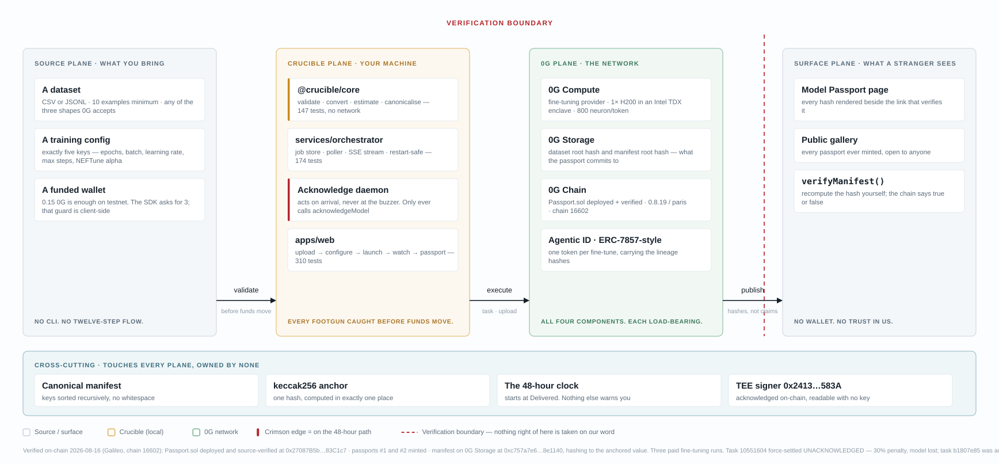
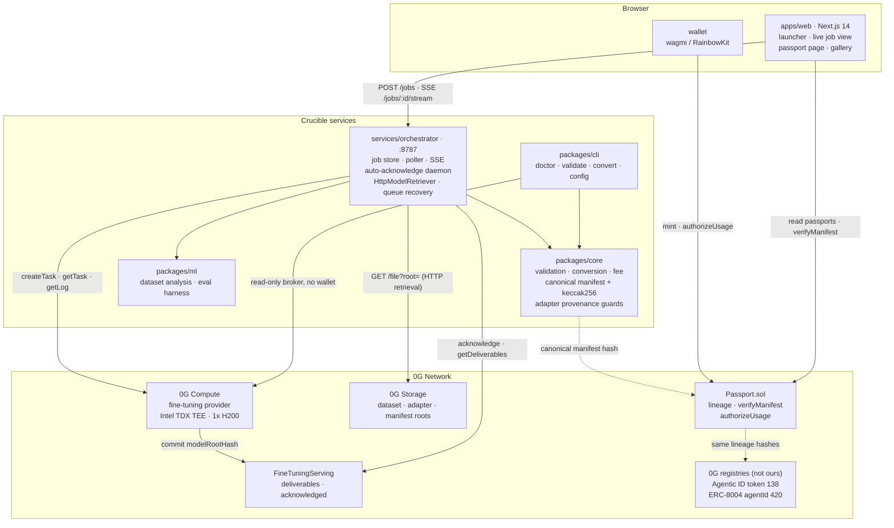

# Architecture

Reference architecture, components, the on-chain contract, the orchestrator API and the manifest format. For what the system does and does not prove, read [THREAT_MODEL.md](THREAT_MODEL.md). The older Wave 3 write-up is [../submission/ARCHITECTURE.md](../submission/ARCHITECTURE.md).

## Four planes, separated by what each is allowed to assert

The planes are separated by *what a reader has to take on trust*. Everything to the right of the dashed line in Fig. 1 is checkable by someone who has never met me: the manifest is public, the hash is on a public chain, and verification needs no key.



<sub>**Fig. 1**: Four-plane reference architecture. Crimson edges mark the 48-hour acknowledgement path, the one place where a delay costs you the artifact. Every figure in the footer is measured on-chain, not specified (see [Evidence](EVIDENCE.md)).</sub>

Crucible never asks you to trust its own database. If this repository disappears tomorrow, passport #1 remains verifiable from the chain and 0G Storage alone.

## Components



| Component | Owns | Notes |
|---|---|---|
| `packages/core` (`@crucible/core`) | Every rule checkable without a network: dataset format, the five-key training config, fee arithmetic, manifest shape and canonical hash, task-state, model card, adapter-hash provenance | Pure. No test in the repo needs a private key, funds or a live network. |
| `packages/cli` | `crucible doctor · validate · convert · config` | No private key. `doctor` is a live preflight via the read-only broker. |
| `packages/ml` | Dataset analysis (balance, duplicates, leakage, length, PII) and an eval harness | Advisory findings cross into the job record as counts, types and line numbers only, never the matched secret. |
| `services/orchestrator` | Everything stateful and time-dependent: job store, poller, SSE, acknowledger, HTTP retrieval, `storage-hash.ts`, queue recovery | HTTP on `:8787`. |
| `apps/web` | UI. Consumes core and the orchestrator; owns nothing shared | Runs on fixtures when no orchestrator URL is set. |
| `contracts` | `Passport.sol`, deploy, mint and verification scripts | Solidity 0.8.19, `evmVersion: paris`. |
| `tools/` | Read-only diagnostics and run scripts: task status, deliverable state, dataset identification, manifest upload, TEE attestation, verification | `verify-manifest.mjs` reimplements canonicalisation inline so a verifier can read the whole trust chain in one file. |

## Contract: `Passport.sol`

```solidity
struct PassportData {
    bytes32 baseModelHash;
    bytes32 datasetRootHash;
    bytes32 configHash;
    bytes32 adapterRootHash;
    bytes32 manifestRootHash;   // public, verifiable without decryption
    string  taskId;
    address provider;
    uint64  mintedAt;
}
```

Public surface: `mint`, `passportOf`, `encryptedURIOf`, `verifyManifest`, `totalMinted`, `lineageKey`, `tokenIdForLineage`, `authorizeUsage`, `revokeAuthorization`, `isAuthorized`, `permissionsOf`, `authorizedCount`, `authorizedExecutors`.

Invariants:

- Lineage is immutable after mint, including through transfer.
- At most 100 authorizations per token; **all authorizations clear on transfer**, so a buyer does not inherit the seller's grants.
- The same `(datasetRootHash, configHash, adapterRootHash)` triple cannot be minted twice: one fine-tune, one passport.
- `mint()` rejects a zero adapter hash. A run with no adapter records an explicit sentinel, `keccak256("crucible:adapter-not-retrieved:<taskId>")`.

Full ABI and behaviour: [contracts/README.md](../contracts/README.md), [docs/INTERFACES.md §4](INTERFACES.md).

## Orchestrator HTTP API

Base `http://localhost:8787` (override with `CRUCIBLE_API_URL`).

| Method | Path | Returns |
|---|---|---|
| `GET` | `/health` | `{ ok: true, version }` |
| `POST` | `/jobs` | `Job`; body `{ network, provider, model, datasetPath \| datasetRootHash, config }` |
| `GET` | `/jobs` · `/jobs/:id` | `Job[]` · `Job` |
| `GET` | `/jobs/:id/logs` | `{ logs }` |
| `GET` | `/jobs/:id/stream` | SSE, `event: state`, `data: Job` |
| `POST` | `/jobs/:id/unlock` | `{ ok, txHash }`; Bug #4 escape hatch for a job we hold |
| `POST` | `/jobs/:id/retrieve` | Retrieve, validate and upgrade a failed run in place |
| `GET` | `/providers/:provider/lock` | `LockDetection` |
| `POST` | `/providers/:provider/unlock` | `UnlockResult`, for a queue stranded by a task we have no record of |
| `GET` | `/passports` · `/passports/:id` | `PassportManifest[]` · `PassportManifest` |

A failed chain read on the lock route returns `502`, never `locked: false`. The `Job` shape, including `ackDeadlineMissed`, `artifactAtRisk`, `transitions` and `quality`, is in [docs/INTERFACES.md §5](INTERFACES.md).

## Data: the manifest

```jsonc
{
  "version": 1, "network": "testnet", "chainId": 16602, "createdAt": "…",
  "task":     { "id": "…", "provider": "0xA02b95Aa…", "state": "UserAcknowledged" },
  "base":     { "model": "Qwen2.5-0.5B-Instruct", "modelHash": "0x…", "tokenizer": "Qwen/Qwen2.5-0.5B-Instruct" },
  "dataset":  { "rootHash": "0x…", "format": "chat", "exampleCount": 61, "tokenCount": 14816 },
  "training": { "neftune_noise_alpha": 5, "num_train_epochs": 3, "per_device_train_batch_size": 2,
                "learning_rate": 0.0002, "max_steps": 10 },
  "adapter":  { "rootHash": "0x…", "sizeBytes": 93642471, "hashSource": "onchain-verified" },
  "fee":      { "trainingNeuron": "…", "storageReserveNeuron": "…", "totalNeuron": "…" },
  "tee":      { "signerAddress": "0x24135b4B…", "acknowledged": true, "attestationVerified": true }
}
```

Values follow Passport #3 (`contracts/deployments/galileo-mints.json`). `adapter.hashSource` is optional so legacy manifests hash identically. Canonicalisation is the load-bearing invariant: identical content must serialise byte-identically regardless of key order, or the on-chain anchor means nothing.

## 0G components and protocols used, and why

| Component / protocol | How Crucible uses it | Why |
|---|---|---|
| **0G Compute** (`@0gfoundation/0g-compute-ts-sdk@0.9.0`) | Read-only broker for `listService` / `listModel` with no wallet; live `pricePerToken` for fee estimates; `createTask` → `getTask` / `getLog` → acknowledge. Never calls the deprecated `downloadModelFrom0GStorage` + `decryptModel` pair. | Training runs in an Intel TDX TEE (Phala dstack, 1x H200) on infrastructure the model owner does not control. |
| **0G Storage** (`@0gfoundation/0g-storage-ts-sdk@1.2.11`, indexer HTTP) | Dataset upload by root hash; adapter retrieval over HTTP; manifest storage. `storage-hash.ts` is a dependency-free, SDK-exact reimplementation of the Merkle root, pinned by known-answer tests generated from the SDK across 11 sizes. | The dataset root is what 0G validates the delivered artifact against, and what a third party fetches to check the training data. |
| **0G Chain** (Galileo 16602; mainnet 16661 configured) | `Passport.sol` anchors the manifest hash; `FineTuningServing` at `0xC6C075D8039763C8f1EbE580be5ADdf2fd6941bA` is read for deliverable state. | The contract is authoritative. Provider-reported status is off-chain and advisory. |
| **Agentic ID, ERC-7857-style** | One fine-tune mints one token carrying its lineage. `authorizeUsage` implemented; oracle re-encrypting `transfer()` and `clone()` are not. | Provenance travels with ownership instead of sitting in a database row. |
| **0G's official Agentic ID** `0x2700F6A3e505402C9daB154C5c6ab9cAEC98EF1F` | The six lineage hashes minted as **token #138** via the open `iMint` (tx `0x6e38a421581bc2f0895666694c89221394b946a9b925d41f39e37c417bc8ef68`, block 51,470,421, 715,109 gas, `mintFee` 0). | Cross-check in a contract Crucible does not control: read the manifest root from 0G's registry, pass it to `verifyManifest(2, …)`, get `true`. See [docs/AGENTIC_ID_ALIGNMENT.md](AGENTIC_ID_ALIGNMENT.md). |
| **ERC-8004 Identity Registry** `0x8004A818BFB912233c491871b3d84c89A494BD9e` (Galileo) | Passport #1 registered as **agentId 420**, plus six `setMetadata` lineage writes read back byte-equal. Register tx [`0x2a2e86d0…`](https://chainscan-galileo.0g.ai/tx/0x2a2e86d027c6865b3be8826142179e97354249bab931c31494062b5352d2c85a), block 55,445,626. | A second registry Crucible does not control. **Registered, not verified.** See [docs/ERC8004.md §7](ERC8004.md). |
| **`keccak256` over canonical JSON** | The manifest hash anchored on-chain. | Any verifier can reimplement it in any language from one file. |

