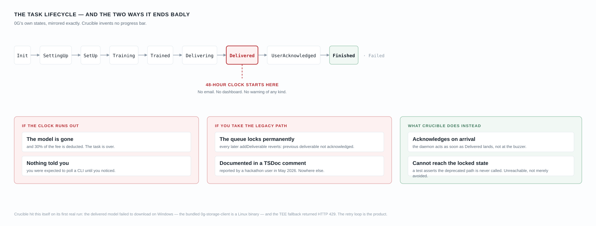
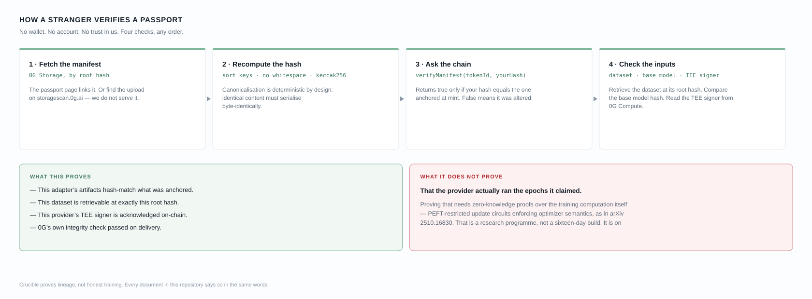

# Evidence you can run

Everything here is reproducible against public endpoints. Hashes and transaction ids are copied from `contracts/deployments/` and `runs/`; the commands are the ones in `tools/`. To check Passport #3 live yourself, run `node tools/verify-manifest.mjs 0xdfaa9b837e339c2aa87c8e52fed102390ffeb22392beb58d4ffb3589aab216a7 3` (recorded output: [sample/verify-onchain-passport3.txt](sample/verify-onchain-passport3.txt)).

## Passport #3 end to end

The real run, 2026-09-18, on native Windows. Task `d06d00e2-965b-430c-bf46-4d6444ee1c47`.

```mermaid
sequenceDiagram
    autonumber
    participant D as Dataset (0G Storage)
    participant P as 0G Compute TEE provider
    participant R as HttpModelRetriever
    participant F as FineTuningServing (0G Chain)
    participant S as 0G Storage
    participant X as Passport.sol

    Note over D: sentiment set, 61 chat examples,<br/>root 0xa5051ae7…9e7dbfd (reused, no re-upload)
    P->>P: Init → SettingUp → … → Delivered
    P->>F: commit modelRootHash 0x113b79c3…396c
    R->>S: GET {indexer}/file?root=0x113b79c3…
    Note over R: first attempt dropped at 61,351,230 B<br/>(schannel close); resumed retry<br/>completed 93,642,471 B
    R->>R: re-derive 0G Storage Merkle root
    R-->>R: matches on-chain root → hashSource: onchain-verified
    R->>F: acknowledge (tx 0xaf0a48b0…, block 55,456,191)
    F-->>R: acknowledged: true
    Note over R: verifyService: TEE signer + compose hash<br/>match on-chain → attestationVerified: true
    R->>S: upload canonical manifest (root 0xdfaa9b83…b216a7)
    R->>X: mint token 3 with manifest hash 0x2e38e49c…85ef13<br/>(tx 0x1dde66f4…, block 55,457,526)
    X-->>R: verifyManifest(3, 0x2e38e49c…) = true
```

Step by step:

1. **Fine-tune.** The task ran `Init → … → Delivered → UserAcknowledged` against the testnet provider `0xA02b95Aa6886b1116C4f334eDe00381511E31A09` on base model `Qwen2.5-0.5B-Instruct`, with `num_train_epochs: 3`, `per_device_train_batch_size: 2`, `learning_rate: 0.0002`, `neftune_noise_alpha: 5`, `max_steps: 10`.
2. **Retrieve.** `HttpModelRetriever` downloaded the 93,642,471-byte adapter from the 0G Storage indexer. The first attempt died at 61 MB; a resumed retry (a curl `fetchImpl` passed into the retriever, transport only) completed it.
3. **Validate before acknowledging.** The retriever re-derived the 0G Storage Merkle root and matched it to the on-chain model root `0x113b79c3b6c6a0bfa418e044770171b02b475e185fbbdf0ddc932ec6348a396c`.
4. **Acknowledge.** Tx [`0xaf0a48b0…`](https://chainscan-galileo.0g.ai/tx/0xaf0a48b0d538f26f9b5d482ca435593c51005b6fcb0f64d58dc95005d01290b1), `acknowledged: true`.
5. **Attest.** `verifyService` passed: the TEE signer `0x24135b4Bd964872284728F79F5f17eB874C5583A` matches the on-chain registration and the compose hash matches the event log. Recorded in `runs/attestation-testnet.json`.
6. **Build the manifest.** `@crucible/core` canonicalises it (keys sorted recursively, no whitespace) and takes `keccak256`: `0x2e38e49c164712d533c600f6a0242cca9cf75bf3832a28699d9208127685ef13`.
7. **Store it.** 1,027 bytes on 0G Storage at root `0xdfaa9b837e339c2aa87c8e52fed102390ffeb22392beb58d4ffb3589aab216a7`, upload tx `0x990ea1f4…3cc015`.
8. **Mint.** Token 3, tx [`0x1dde66f4…`](https://chainscan-galileo.0g.ai/tx/0x1dde66f40f24bbd353160e6995764ba208096e74ce39a3563c3726e13066fff3). `verifyManifest(3, …)` returns `true`; a wrong hash returns `false`.

Cost: settled task fee **0.0118528 0G**, charged to the compute sub-account. The wallet paid **~0.00265 0G** of gas for acknowledge, mint and manifest upload.

This run used the real `HttpModelRetriever` and validation, driven by the `tools/run4-*` scripts. Carrying the same run through `POST /jobs` and the daemon on Windows is still open. Records: `runs/run4-e2e.json`, `runs/run4/mint.json`.

Nothing here needs my cooperation. Every command runs against public endpoints.

## The contract is real and its source is published

```bash
curl -s "https://chainscan-galileo.0g.ai/open/api?module=contract&action=getsourcecode\
&address=0x27087B5bD124f2a570eb22B6B5bbe05F5d83C1c7"
```

Returns `status: 1`, `ContractName: Passport`, `CompilerVersion: v0.8.19+commit.7dd6d404`, `EVMVersion: paris`, `OptimizationUsed: 1`, `Runs: 200`, and 78,649 characters of source. Deployed at block 49596815 using 2,238,586 gas (deploy tx `0x302a4278…6dd1`). Human view: [chainscan-galileo.0g.ai/address/0x27087B5b…#code](https://chainscan-galileo.0g.ai/address/0x27087B5bD124f2a570eb22B6B5bbe05F5d83C1c7#code).

## Passport #1's manifest is on 0G Storage

Root hash `0xc757a7e66c1c5bf4d642e4fbf246b5c228e2ccbf070de2669b98e0e3b98e1140`, 584 bytes, [submission 146937](https://storagescan-galileo.0g.ai/submission/146937).

```bash
curl -s "https://indexer-storage-testnet-turbo.0g.ai/file?root=0xc757a7e66c1c5bf4d642e4fbf246b5c228e2ccbf070de2669b98e0e3b98e1140"
```

## That manifest hashes to what the chain says

```bash
node tools/verify-manifest.mjs                # passport #1 by default
node tools/verify-manifest.mjs <rootHash> <tokenId>
```

The script downloads the manifest, canonicalises it, takes `keccak256`, and calls `verifyManifest` on the deployed contract, then repeats with a corrupted hash.

```
manifest keccak256                         0x4f64bfe6db470029d79ede7d83b184b003ed88ea380f5f4cce81502c6059890f
passportOf(1).manifestRootHash             ← identical
verifyManifest(1, that hash)               true
verifyManifest(1, keccak256("tampered"))   false
```

Passport #1 was minted at block 49597171 using 327,702 gas.

## Two runs, one variable: the penalty is on-chain

```bash
node tools/task-status.mjs      # provider-side state
```

Reading 0G's `FineTuningServing` at `0xC6C075D8039763C8f1EbE580be5ADdf2fd6941bA`:

| | task `10551604-…f93bfc`, **Windows** | task `3e385c46-…7ae3`, **WSL2 Linux** |
|---|---|---|
| `modelRootHash` | `0xbd1df54d…40a4` | `0x40a5f256…1b4d` |
| `encryptedSecret` | `0x`, empty, no key ever shared | `0x`, empty |
| `acknowledged` | **`false`** | **`true`** |
| Artifact retrieved | none | **93,642,469 bytes**, sha256 `0x9f788764…8026ae1d` |
| Actually debited | **0.00355584 0G = 30.0000% penalty** | full fee, model in hand |
| Passport | **#1**, sentinel adapter hash | **#2**, real adapter root hash |

30% is 0G's documented deduction for a deliverable the user never acknowledged. It is the arithmetic proof that the model was forfeited rather than collected.

**Everything else about those two runs is identical**: same contract, wallet, dataset, base model, training config, provider and SDK version. The single variable is the operating system the acknowledgement ran on. That makes it a diagnosis rather than an anecdote.

```bash
# passport #2, the run that kept its model, minted only after reading acknowledged=true off-chain
#   mint tx  0x60094f63813827391266d7f77c02649342b435d86d297964d499d2deae420324  block 49612106
#   ack tx   0x0911a1326338fc260a237c3c27baf8a697ffa193f2aec7c876c7d43207c15aeb
```

## Passport #3: retrieved and acknowledged on Windows, after the fix

| | task `d06d00e2-…ee1c47`, **Windows, after the fix** |
|---|---|
| `modelRootHash` | `0x113b79c3…396c` |
| Artifact retrieved | **93,642,471 bytes** over plain HTTP; first attempt dropped at 61 MB on a `schannel` close, a resumed retry completed it; 0G Storage root re-derived and matched |
| `acknowledged` | **`true`**, ack tx [`0xaf0a48b0…`](https://chainscan-galileo.0g.ai/tx/0xaf0a48b0d538f26f9b5d482ca435593c51005b6fcb0f64d58dc95005d01290b1) |
| Adapter provenance | **`onchain-verified`**, a real root, not a sentinel |
| Attestation | **`attestationVerified: true`**; `verifyService` checked the TEE signer and compose hash against the chain |
| Passport | **#3**, mint tx [`0x1dde66f4…`](https://chainscan-galileo.0g.ai/tx/0x1dde66f40f24bbd353160e6995764ba208096e74ce39a3563c3726e13066fff3), `verifyManifest(3, …)` = **true** |

Same contract, wallet and provider as the run that lost its model (see "Two runs, one variable" above). This time, on Windows, the model came home.

## The daemon on its own (run 3, Linux)

On 2026-08-16 the orchestrator ran task `b1807e85-a942-46f5-9d04-ec23fdff020a` end to end with no script and no setting changed. Delivered 08:53:57Z, acknowledgement scheduled for 09:53:57Z, 93,642,471 bytes pulled from 0G Storage, acknowledged on-chain at 09:56:05Z in tx [`0x4e2c81e2…7e4cfa`](https://chainscan-galileo.0g.ai/tx/0x4e2c81e237efc53623d869d361f212bf649ff132dc6274fbb18dc0d80c7e4cfa), block 49716408. `getDeliverables` reads `acknowledged: true`. It used the default `downloadMethod: 'auto'`, the same 0G Storage path that ENOENTs on Windows. Record: `runs/run3-daemon.json`.

## The 48-hour budget



<sub>**Fig. 2**: 0G's task lifecycle, mirrored rather than re-invented. The clock starts at `Delivered`. `Finished` means the *provider* settled; it does not mean you hold anything.</sub>

0G's documentation: *"You must download and acknowledge the model within 48 hours after the task status changes to `Delivered`."* Miss it and *"30% of the total task fee will be deducted as compensation for the provider's compute resources."*

Two things about that window are not in the documentation, and both cost me a model:

- **The provider does not wait 48 hours.** Task 1 settled six hours after delivery. The 48 hours bounds *your* right to collect, not when the provider acts.
- **`Finished` does not mean acknowledged.** The provider API reported `progress: Finished`. The chain said `acknowledged: false` and the debit was 30%. Provider status is advisory; the contract is authoritative. I published the wrong conclusion before checking the contract, and [CHANGELOG.md](../CHANGELOG.md) records the correction rather than editing it away.

When run 1 happened, the daemon could not prevent the loss on Windows because SDK retrieval itself was broken; it could only detect the delivery, exhaust every download path, record the failure and release the queue with `acknowledgeDeliverable`. Since 2026-09-18 (`5e089f4`) it retrieves on Windows over HTTP. The honesty rule is unchanged: it acknowledges only against a root that matches the on-chain `modelRootHash`.



<sub>**Fig. 3**: The verification path and its boundary. Everything on the left is checkable by a stranger with no wallet. The right-hand panel is what no amount of hashing can establish.</sub>

