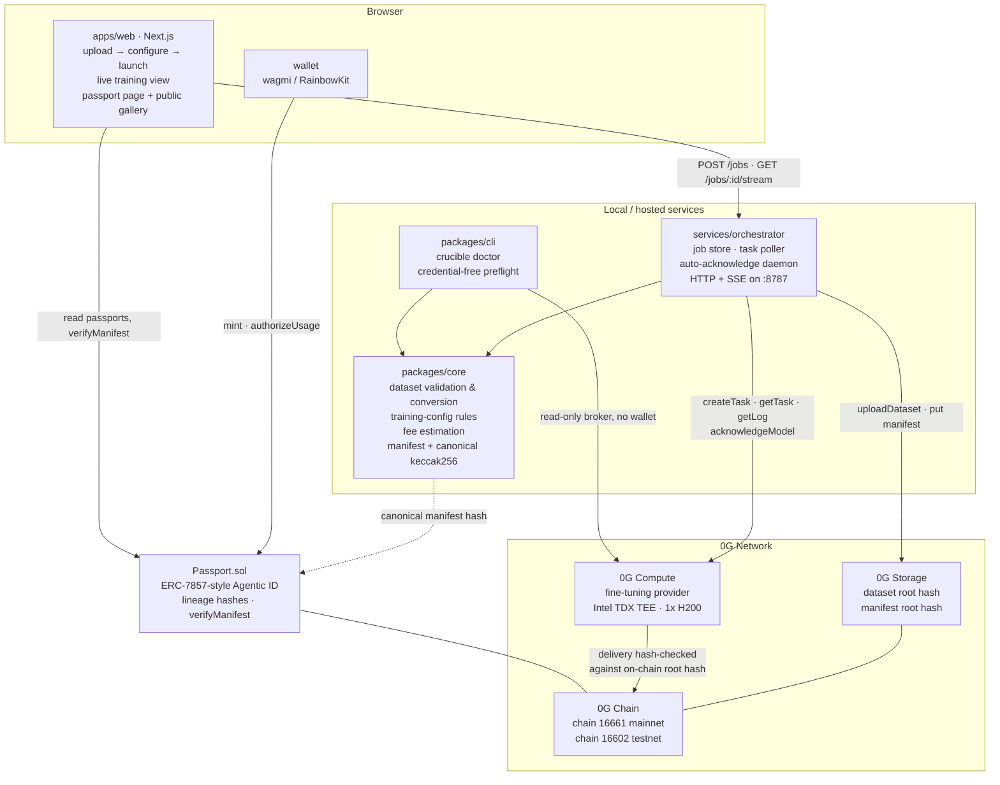
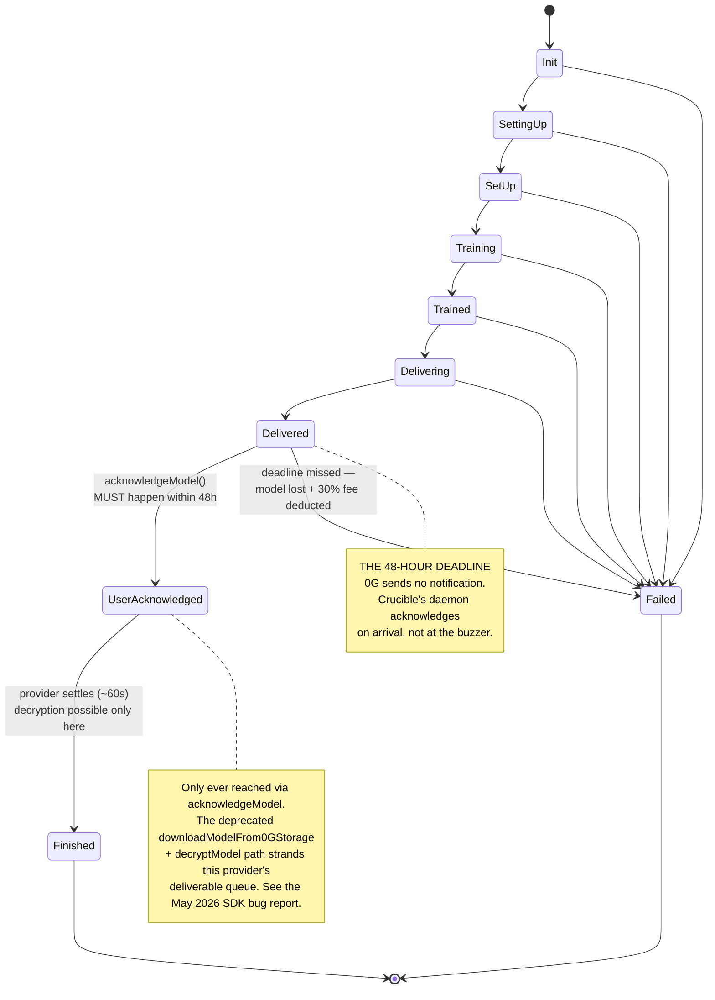

# Crucible — Architecture

Technical description for the 0G Bridge Buildathon, Wave 3.

Crucible turns a fine-tuning run on the 0G Compute Network into a **Model Passport**: a
canonical manifest recording the base model, dataset, hyperparameters, fee and TEE provider,
stored on 0G Storage, hash-anchored on 0G Chain, and minted as an ERC-7857-*style* Agentic ID.

Every network value in this document was verified against the live 0G network on 2026-08-14
and is recorded in [../docs/FIELD_NOTES.md](../docs/FIELD_NOTES.md). Component boundaries are
fixed by [../docs/INTERFACES.md](../docs/INTERFACES.md).

---

## 1. Components



**Boundaries, briefly.**
`packages/core` owns every rule that can be checked without a network — dataset format,
the five-key training config, fee arithmetic, the manifest shape and its canonical hash. It is
pure and fully unit-testable, which is why no test in this repo requires a private key, funds,
or a live network. `services/orchestrator` owns everything stateful and time-dependent: the job
record, the poller, and the daemon that must act before a deadline. `apps/web` consumes both and
owns nothing shared. `contracts` owns the on-chain shape.

---

## 2. The full flow — fine-tune → passport → mint

```mermaid
sequenceDiagram
    autonumber
    actor U as User
    participant W as apps/web
    participant O as orchestrator
    participant C as core
    participant S as 0G Storage
    participant P as 0G Compute TEE
    participant X as Passport.sol on 0G Chain

    U->>W: upload dataset + choose base model
    W->>O: POST /jobs
    O->>C: validate dataset + training config
    C-->>O: JSONL, example count, format
    Note over C: every 0G rejection rule is caught<br/>locally, before any funds move
    O->>C: estimate fee from live pricePerToken
    C-->>O: training + storage reserve + total (neuron)
    W-->>U: cost shown, confirm

    O->>S: uploadDataset(jsonl)
    S-->>O: dataset root hash
    Note over O,S: the root hash is persisted before task creation,<br/>so a crash here never costs a second upload

    O->>P: createTask(provider, model, datasetHash, config)
    P-->>O: taskId

    loop poll until terminal
        O->>P: getTask / getLog
        P-->>O: state + training logs
        O-->>W: SSE event: state
        W-->>U: live progress
    end

    P->>X: deliverable committed, artifact hash on-chain
    P-->>O: state = Delivered
    Note over O: 48-hour clock starts.<br/>daemon schedules acknowledge immediately —<br/>always acknowledgeModel, never the legacy path

    O->>P: acknowledgeModel(provider, taskId, path)
    P-->>O: LoRA adapter downloaded + hash-verified
    Note over O,P: state reaches Finished ~60s later;<br/>decryption before Finished fails with<br/>'second arg must be public key'

    O->>C: build PassportManifest
    C-->>O: canonical JSON + keccak256 manifest hash
    O->>S: store manifest
    S-->>O: manifest root hash

    W-->>U: passport page — every hash with its verification link
    U->>X: mint(to, PassportData, encryptedURI)
    X-->>U: tokenId — ERC-7857-style Agentic ID

    Note over U,X: anyone can now recompute the manifest hash<br/>and call verifyManifest(tokenId, hash) — no wallet needed
```

---

## 3. Task lifecycle

Ten states, mirroring 0G's real fine-tuning state machine. Ordered; never runs backwards; any
state can fail. The transition that destroys models is `Delivered`.



A provider reporting `occupied: true` is a **queued** state in Crucible's job model, not an
error — there is exactly one fine-tuning provider per network and tasks run one at a time.

---

## 4. The Model Passport

The manifest is the artifact everything else points at. The block below is the **schema shape**
with illustrative values — it is not passport #1, and it is not a record of a run. It is written
against testnet because testnet is the only network anything here has run on; a sample labelled
`mainnet` would depict a run that does not exist. (Passport #1 is on testnet, its `state` never
reached `Finished`, and its `adapter.rootHash` is a labelled sentinel; see §4.1.)

```jsonc
{
  "version": 1,
  "network": "testnet",
  "chainId": 16602,
  "createdAt": "…",
  "task":     { "id": "…", "provider": "0xA02b95Aa…", "state": "Finished" },
  "base":     { "model": "Qwen2.5-0.5B-Instruct", "modelHash": "0x…", "tokenizer": "Qwen/…" },
  "dataset":  { "rootHash": "0x…", "format": "instruction", "exampleCount": 50, "tokenCount": 10000 },
  "training": { "neftune_noise_alpha": 5, "num_train_epochs": 3,
                "per_device_train_batch_size": 2, "learning_rate": 0.0002, "max_steps": 45 },
  "adapter":  { "rootHash": "0x…", "sizeBytes": 0 },
  "fee":      { "trainingNeuron": "…", "storageReserveNeuron": "…", "totalNeuron": "…" },
  "tee":      { "signerAddress": "0x24135b4B…", "acknowledged": true, "attestationVerified": false }
}
```

`attestationVerified` is `false` here and in every passport minted so far, deliberately. Crucible
records the TEE signer and whether the provider has acknowledged it on-chain, both of which are
readable without a key — but it does not yet call `verifyService()` to check the attestation
itself. Until it does, no real run can produce `true`, so a sample showing `true` would be a
shape no reader could ever reproduce. Earning that field is a roadmap item, named as one.

**Canonicalization is the load-bearing invariant.** `canonicalize(manifest)` emits JSON with
every key sorted recursively and no whitespace; `manifestHash = keccak256(utf8(canonical))`.
Two manifests with identical content must serialize byte-identically regardless of key insertion
order — otherwise the on-chain anchor means nothing, because a verifier could not reproduce it.

On-chain, `Passport.sol` stores the lineage as fixed-width hashes:

```solidity
struct PassportData {
    bytes32 baseModelHash;
    bytes32 datasetRootHash;
    bytes32 configHash;
    bytes32 adapterRootHash;
    bytes32 manifestRootHash;   // public — verifiable without decryption
    string  taskId;
    address provider;
    uint64  mintedAt;
}
```

Invariants: lineage is immutable after mint; at most 100 authorizations per token; **all
authorizations are cleared on transfer**; and the same
`(datasetRootHash, configHash, adapterRootHash)` triple cannot be minted twice — one fine-tune,
one passport.

### 4.1 Passport #1 — what the one real token actually contains

Passport #1 exists on Galileo testnet and is a **smoke test of the contract, not a completed
fine-tune.** The distinction matters enough to spell out field by field:

| Field | Value | Real? |
|---|---|---|
| `taskId` | `10551604-2664-4516-86cf-269a62f93bfc` | ✅ the actual paid 0G Compute task |
| `provider` | `0xA02b95Aa…1E31A09` | ✅ the live testnet fine-tuning provider |
| `datasetRootHash` | `0xa5051ae7…9e7dbfd` | ✅ really uploaded, tx `0xc38e4131…d7da52` |
| `baseModelHash` | `0xb4f76a88…6c2c75a7` | ✅ read off the task 0G created |
| `configHash` | `0xe65b3e51…89cca55f1` | ✅ keccak256 of the exact config that task carried |
| `manifestRootHash` | `0x4f64bfe6…6059890f` | ✅ anchored; `verifyManifest(1, …)` returns `true` |
| `adapterRootHash` | `0x418e9f5f…8c5ae8eb` | ❌ **a sentinel** |

The adapter hash is `keccak256("crucible:adapter-not-retrieved:<taskId>")`. `mint()` rejects a
zero adapter hash, so a sentinel is the honest way to record "no adapter here" — and it is
deliberately *not* a plausible-looking root hash, so anyone who recomputes it learns immediately
that no adapter exists rather than being misled by something that looks real.

Why there is no adapter: the task reached `Delivered`, then `acknowledgeModel` failed twice over
(ENOENT on the bundled Linux-ELF `0g-storage-client` under Windows, then HTTP 429 from the TEE
fallback), and the provider settled the deliverable unacknowledged. The chain still shows it:
`acknowledged: false`, `settled: true`, `encryptedSecret` empty, and a `FeesSettled` event
charging exactly 30% of the fee — 0G's documented penalty for a model the user never collected.
The adapter really was produced, at root hash `0xbd1df54d…`, and without the decryption key it
is unrecoverable.

That failure is the reason this project exists, and it is why the auto-acknowledge daemon in §1
is the load-bearing component rather than a convenience.

---

## 5. Which 0G modules we use and how

Crucible uses **all four** 0G components. Not as a checklist — each one is load-bearing, and
removing any of them breaks a specific guarantee.

### 5.1 0G Compute — where training happens

SDK: `@0gfoundation/0g-compute-ts-sdk@0.9.0`.

- **Discovery without credentials.** `createZGComputeNetworkReadOnlyBroker(rpcUrl)` requires no
  wallet and no private key. Crucible uses it for `fineTuning.listService()` and
  `fineTuning.listModel()`, which is what lets `crucible doctor` and the web app's provider view
  work for a visitor who has connected nothing. It is also why this project's entire discovery
  and validation layer was built and tested before a wallet was ever funded.
- **Fee estimation.** `pricePerToken` is read live from the service struct — 500 neuron/token on
  mainnet, 800 on testnet — and combined with the per-model storage reserve fee. `core`'s fee
  module reproduces 0G's own documented worked example exactly, which is how we know the
  arithmetic matches theirs rather than merely looking plausible.
- **Task execution.** `createTask` → `getTask` / `getLog` polling → `acknowledgeModel`. The
  orchestrator never calls the deprecated `downloadModelFrom0GStorage` + `decryptModel` pair.
- **TEE.** Both providers run Intel TDX via Phala dstack on 1x H200 (8 vCPU, 187 GB RAM, 900 GB
  disk) and share the TEE signer `0x24135b4Bd964872284728F79F5f17eB874C5583A`, which is
  acknowledged on-chain; `verifyService()` checks the attestation. This is why the passport's TEE
  section is a checkable claim rather than a marketing sentence. The task that actually ran used
  the **testnet** provider `0xA02b95Aa6886b1116C4f334eDe00381511E31A09`; the mainnet provider
  `0x940b4a101CaBa9be04b16A7363cafa29C1660B0d` has been probed read-only but not paid.
- **The footgun handling is the product.** Acknowledgement is scheduled the moment `Delivered` is
  observed, and only ever via `acknowledgeModel`. Decryption waits for `Finished`. The dataset
  root hash is persisted before task creation, so a crash between upload and task creation never
  costs a second upload.
  - Not yet implemented, and named here rather than implied: **automatic sub-account funding.**
    0G's own documentation records that `transfer-fund` routes to the *inference*
    sub-account unless `--service fine-tuning` is passed, surfacing much later as an
    unexplained `MinimumDepositRequired`. Documented by 0G, not measured by us. The footgun is documented in `docs/FIELD_NOTES.md` and was handled
    by hand during the spike; there is no `transferFund` call in this codebase yet.

### 5.2 0G Storage — where the evidence lives

Indexers: `https://indexer-storage-turbo.0g.ai` (mainnet),
`https://indexer-storage-testnet-turbo.0g.ai` (testnet).

- **The dataset** is uploaded before task creation and addressed by its root hash. That root hash
  is what the 0G contract validates the delivered artifact against, and it is what a third party
  retrieves to check that a passport's training data is what it says it is. Done for real: root
  `0xa5051ae7…9e7dbfd`, upload tx `0xc38e4131…d7da52`.
- **The manifest is not yet stored on 0G Storage.** Today only its `keccak256` is anchored
  on-chain, and the orchestrator serves the manifest body from local files. That is enough to
  *detect* tampering — `verifyManifest` compares against the anchor — but it means a passport
  currently depends on this project serving the manifest, which is the weaker property.
  Storing manifests on 0G Storage is designed and is the first item of the next wave: provenance
  that depends on a running server is not provenance.

> **Implementation note, so nobody is surprised.** The dataset upload that actually ran used
> `@0gfoundation/0g-storage-ts-sdk` in a standalone script, because both of the compute SDK's own
> upload paths are broken on Windows (`uploadDatasetToTEE()` throws `window is not defined`;
> `uploadDataset()` spawns a bundled `0g-storage-client` that ships as a **Linux ELF**). The
> orchestrator's code path still calls `broker.uploadDataset()`, so it inherits that limitation
> on Windows hosts. The storage SDK is not yet a dependency of any package in this repo.

### 5.3 0G Chain — where the claim becomes checkable

Two networks, and only one of them currently has a contract on it:

| | Testnet — Galileo **16602** | Mainnet — **16661** |
|---|---|---|
| RPC | `https://evmrpc-testnet.0g.ai` | `https://evmrpc.0g.ai` |
| Explorer | `https://chainscan-galileo.0g.ai` | `https://chainscan.0g.ai` |
| `Passport.sol` | ✅ `0x27087B5bD124f2a570eb22B6B5bbe05F5d83C1c7` | ❌ **not deployed** |
| Source-verified | ✅ `v0.8.19+commit.7dd6d404`, `paris`, optimizer 200 | — |
| Mints | ✅ passport #1 | ❌ none |

Solidity 0.8.19 with `evmVersion: paris` — 0.8.19 is pinned because newer versions fail explorer
source verification, and paris because 0.8.19 cannot emit cancun (that target arrived in 0.8.24).
Paris verified on the explorer first try, so 0G's docs asking for cancun are advice, not a
constraint.

- `Passport.sol` is deployed and source-verified on Galileo testnet. **Mainnet is the Wave 3
  hard requirement and is still open.**
- `verifyManifest(tokenId, candidateHash)` is a `view` function: anyone can recompute the
  canonical hash from a manifest and ask the chain whether it matches what was anchored at mint
  time. No wallet, no trust in this project. Demonstrated live on passport #1 —
  `verifyManifest(1, 0x4f64bfe6…890f)` → `true`, and `false` for a tampered hash.
- Mints, authorizations and revocations are the on-chain activity the submission points at.

### 5.4 0G Agentic ID (ERC-7857-style) — where the model gets an identity

Patterns studied from `0gfoundation/agenticID-examples` and reimplemented.

> **Scope, stated up front.** `Passport.sol` is **ERC-7857-*style*, not a full implementation.**
> It implements the identity and authorization surface; it does **not** implement ERC-7857's
> `transfer()` with oracle re-encryption, nor `clone()`. Passport lineage is public by design —
> there is no encrypted metadata for an oracle to re-encrypt — so that half of the standard has
> nothing to act on here. Claiming full compliance would be an overclaim; see
> `docs/CLAIMS_AUDIT.md`.

- One completed fine-tune mints exactly one Agentic ID token. The lineage hashes are the token's
  data, so the provenance travels with ownership rather than sitting in a database row.
- `authorizeUsage(tokenId, executor, permissions)` and `revokeAuthorization` express delegated
  use — the primitive that a model-licensing flow would later be built on. Capped at 100
  authorizations per token, and **all authorizations clear on transfer**, so buying a passport
  does not inherit the seller's grants.
- The encrypted-URI field carries the private artifact reference while `manifestRootHash` stays
  public — which is what allows verification without decryption.

---

## 6. Limits, stated plainly

- **Lineage, not honest training.** Crucible proves the artifacts hash-match, the dataset is
  retrievable, the TEE signer is acknowledged, and 0G's integrity check passed. It does not
  prove the provider ran the epochs it claimed. Proving that requires ZK circuits over the
  training computation (see [arXiv 2510.16830](https://arxiv.org/html/2510.16830v1)) and is
  roadmap, not claim.
- **One provider per network.** 0G currently exposes a single fine-tuning provider on each
  network with a single-task queue. Crucible treats `occupied` as a first-class queued state,
  but it cannot route around a constraint that does not have an alternative yet.
- **The manifest is only as honest as its inputs.** Crucible records what 0G reports. Where 0G
  itself does not attest a value, the passport does not pretend it is attested.
- **Prior art exists.** vouch-protocol's Birth Certificate Protocol, OpenSSF Model Signing v1.0,
  and Cisco's Model Provenance Kit all predate this. Crucible's contribution is the 0G-native
  implementation, not the idea. See [../docs/PRIOR_ART.md](../docs/PRIOR_ART.md).

---

## 7. Local reproduction

Full setup, environment variables and verification steps are in the root
[README](../README.md). The short version:

Root workspaces cover `packages/*` only. `packages/ml`, `services/orchestrator`, `apps/web` and
`contracts` each keep their own lockfile and `node_modules` so their dependency trees cannot
collide, and are installed and run from inside their own directory:

```bash
npm install && npm run build && npm test   # workspaces = packages/* only
npm run doctor -w @crucible/cli            # live network check, no wallet required

cd packages/ml           && npm install --no-workspaces && npm test   # 320 tests
cd services/orchestrator && npm install && npm test && npm start      # 155 tests, then :8787
cd apps/web              && npm install && npm test && npm run dev    # 158 tests, then :3000
cd contracts             && npm install && npx hardhat test           #  70 tests
```

Total **808 tests**, all re-run 2026-08-15, plus a clean `next build` (7 routes, 88.8 kB shared
JS). One thing worth knowing before you try: `apps/web` serves an in-memory fixture store unless
`NEXT_PUBLIC_CRUCIBLE_API_URL` points at a running orchestrator.
